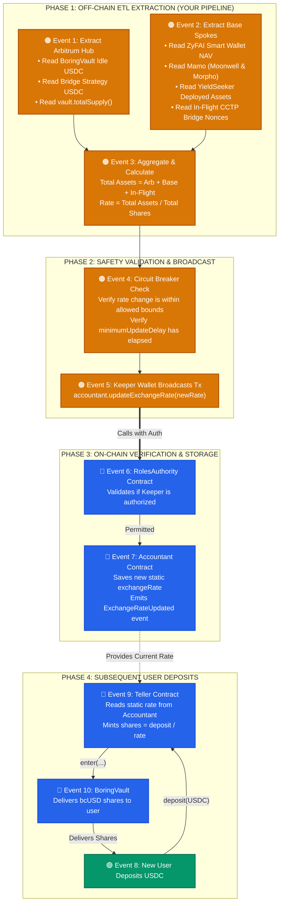

# Off-Chain ETL Rate Calculation & Vault Push Specification

> **Navigation**: [📖 Main Architecture Guide](architecture.md) • [📑 Accountant & Pricing Mechanics](accountant.md) • [🧪 Simulation Runbooks](SIMULATION_MASTER.md)

---

## 🎯 Specification Overview

This document specifies the architecture, audit verification, and event flow for the **Off-Chain ETL Accounting Pipeline**. It defines how the off-chain Data Engineering service calculates the global exchange rate across multi-chain venues (Arbitrum Sepolia hub & Base Sepolia spokes) and broadcasts it to the on-chain smart contracts.

---

## 📋 System Specification Statements

1. **Asset Value Aggregation**:  
   The total asset value is determined by summing the idle test USDC on the **Arbitrum Sepolia hub** and the active deployed assets on the **Base Sepolia spokes**.

2. **Mathematical Exchange Rate Derivation**:  
   The global exchange rate is mathematically derived by dividing this total combined asset value by the total outstanding vault shares.

3. **Broadcast & Target Contract**:  
   The newly calculated exchange rate must be broadcast directly to the `AccountantWithRateProviders` contract located on **Arbitrum Sepolia**.

4. **Access Control & Permissions**:  
   Transaction execution requires a keeper address that has been explicitly granted update permissions by the testnet's `RolesAuthority` framework to authorize the state change.

5. **Pricing Impact on Deposits**:  
   Once successfully updated, this static rate dictates the share allocation pricing for all subsequent testnet deposits until the next update is pushed.

---

## 🔍 Technical Audit & Correctness Verification

A formal audit of the specification against the deployed codebase and smart contracts yields the following findings:

| Specification Point | Codebase Reality | Verification Verdict | Production Recommendations |
| :--- | :--- | :---: | :--- |
| **1. Asset Aggregation** | Multi-chain cash & DeFi positions | **Partially Complete** ⚠️ | • **Include Idle USDC on Base**: Agents often hold un-allocated USDC. If omitted, cash sitting at the spoke disappears from the rate. • **Account for In-Flight CCTP Transfers**: When USDC bridges between Arbitrum and Base, Circle CCTP **burns** it on Arbitrum before minting on Base. During those ~15 minutes, balances on *both* chains read `$0.00`. The ETL must track pending Circle nonces. • **Net of Venue Fees**: Always use balance terms net of venue fees (e.g. ZyFAI's `balanceWithFee`). |
| **2. Rate Derivation** | $\text{Rate} = \frac{\text{Total Assets} \times 10^{\text{shareDecimals}}}{\text{vault.totalSupply()}}$ | **Correct** ✅ | Both USDC and `bcUSD` use 6 decimals ($10^6$). Ensure a fallback to `1.000000` (1e6) when `totalSupply == 0` to avoid division-by-zero. |
| **3. Contract Target** | `accountant.updateExchangeRate(uint96 newExchangeRate)` | **100% Correct** ✅ | Target contract is deployed on Arbitrum Sepolia at [`0x090eD0ff4B6D9a34c9a6100dd2795644B5915aFd`](https://sepolia.arbiscan.io/address/0x090eD0ff4B6D9a34c9a6100dd2795644B5915aFd). |
| **4. Access Control** | `requiresAuth` modifier gated by `RolesAuthority` | **100% Correct** ✅ | Guarded by [`RolesAuthority`](https://sepolia.arbiscan.io/address/0xBEBca977Bb0926ebcBc49cEEC1d6546D2CbFcC38). The broadcasting keeper wallet must be authorized. |
| **5. Bounds & Auto-Pause** | Out-of-bounds updates trigger vault pause | **Critical Caveat** ⚠️ | `AccountantWithRateProviders` has two safety parameters: `minimumUpdateDelayInSeconds` and `allowedExchangeRateChangeUpper` / `Lower`. **If an update violates bounds, it does not revert; it sets `isPaused = true`**, halting deposits and withdrawals until manually reviewed. |
| **6. Deposit Share Pricing** | `Teller` uses stored static rate for share mints | **100% Correct** ✅ | Inside `TellerWithMultiAssetSupport._erc20Deposit`, shares are minted via `shares = depositAmount.mulDivDown(ONE_SHARE, accountant.getRateInQuoteSafe(depositAsset))`. |

---

## 🗺️ High-Level Event Flowchart

* 🟠 **ORANGE** = **Off-Chain ETL & Keeper Pipeline (Data Engineer)**
* 🔵 **BLUE** = **On-Chain Contracts (Arbitrum & Base)**
* 🟢 **GREEN** = **End-User Deposits**

---

## 🛡️ Production Data Engineering Checklist

1. **Multi-Chain Aggregation Formula**:
   $$\text{Total Assets} = \text{USDC}_{\text{Arbitrum Vault}} + \text{USDC}_{\text{Bridge}} + \text{USDC}_{\text{Base Strategies}} + \text{NAV}_{\text{DeFi Protocols}} + \text{In-Flight}_{\text{CCTP}} - \text{Pending Fees}$$

2. **Pre-Flight Sanity Checks (Avoid Auto-Pause)**:
   * Read `accountantState.allowedExchangeRateChangeUpper` and `Lower`.
   * Ensure `block.timestamp >= lastUpdateTimestamp + minimumUpdateDelayInSeconds`.
   * If `|newRate - oldRate| > threshold`, alert the engineering team and **abort the push** instead of triggering a contract-level pause.

3. **Handling Empty Vaults (`totalSupply == 0`)**:
   * Fallback to initial base rate: `1000000` (1.000000 USDC per share).

---

## 🏛️ Testnet Contract Reference

| Contract | Network | Address | Key Methods Used |
| :--- | :---: | :--- | :--- |
| **`AccountantWithRateProviders`** | Arbitrum Sepolia (`421614`) | [`0x090eD0ff4B6D9a34c9a6100dd2795644B5915aFd`](https://sepolia.arbiscan.io/address/0x090eD0ff4B6D9a34c9a6100dd2795644B5915aFd) | `updateExchangeRate(uint96)`, `getRate()` |
| **`RolesAuthority`** | Arbitrum Sepolia (`421614`) | [`0xBEBca977Bb0926ebcBc49cEEC1d6546D2CbFcC38`](https://sepolia.arbiscan.io/address/0xBEBca977Bb0926ebcBc49cEEC1d6546D2CbFcC38) | Access control & keeper permissions |
| **`BoringVault` (`bcUSD`)** | Arbitrum Sepolia (`421614`) | [`0x40dc77867A136bd19dE6F7bb048D2C4c321f05A0`](https://sepolia.arbiscan.io/address/0x40dc77867A136bd19dE6F7bb048D2C4c321f05A0) | `totalSupply()`, `enter(...)` |
| **`TellerWithMultiAssetSupport`** | Arbitrum Sepolia (`421614`) | [`0xA15368BFf702b97EBA1418145509532b497ac565`](https://sepolia.arbiscan.io/address/0xA15368BFf702b97EBA1418145509532b497ac565) | `deposit(asset, amount, minMint)` |
| **`Mamo Base Strategy`** | Base Sepolia (`84532`) | [`0xE5C41ACeAba121746a43927D8b68D5154eaaF4C8`](https://sepolia.basescan.org/address/0xE5C41ACeAba121746a43927D8b68D5154eaaF4C8) | Morpho & Moonwell lending positions |
| **`ZyFAI Base Strategy`** | Base Sepolia (`84532`) | [`0x8EB5426d68f9DCeFE30e9c006AE7fdF524161627`](https://sepolia.basescan.org/address/0x8EB5426d68f9DCeFE30e9c006AE7fdF524161627) | Smart wallet yield portfolio |
| **`YieldSeeker Strategy`** | Base Sepolia (`84532`) | [`0xA9d3B24e2dB0C5278268943c0E0e0133343CBa99`](https://sepolia.basescan.org/address/0xA9d3B24e2dB0C5278268943c0E0e0133343CBa99) | Deployed DeFi yield snapshot |
