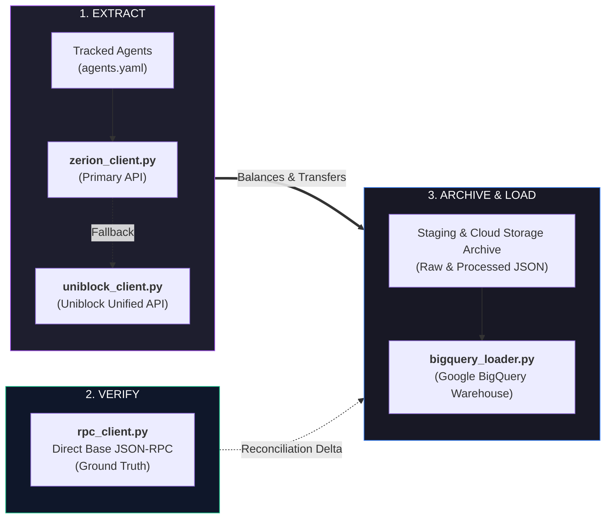

# Core Pipeline & Architecture (Python)

**Location:** `c:\Users\chris\Projects\agent-accounting`  
**Target Environment:** Python 3.12 / GCP Cloud Run / Local PowerShell  

---

## 1. Production Architecture (Simple 3-Stage Model)

The production pipeline automates portfolio accounting and balance reconciliation across Web3 agents using a simple 3-stage process:

> [!NOTE]  
> The diagram above reflects the **production pipeline** running in GCP Cloud Run. For local development and testing, an embedded SQLite database (`zerion.db`) is used for local inspection. See [**Local Testing & Development Guide**](local_testing_and_development.md).

### How It Works in 3 Steps:
1. **Extract:** [`main.py`](etl/main.md) loops through each wallet in `agents.yaml`. It calls [`zerion_client.py`](etl/zerion_client.md) to retrieve token balances and transfers. If Zerion cannot index the address, it falls back to [`uniblock_client.py`](etl/uniblock_client.md), which queries the **Uniblock Unified API** (abstracting underlying data sources into a provider-agnostic interface).
2. **Verify:** [`rpc_client.py`](etl/rpc_client.md) independently queries Base blockchain nodes via JSON-RPC to read exact on-chain balances and ERC-4626 vault share values, calculating any discrepancy.
3. **Archive & Load:** Processed and raw JSON payloads are archived permanently in Cloud Storage (`gs://...-zerion-raw-data/`), and [`bigquery_loader.py`](etl/bigquery_loader.md) streams clean rows into Google BigQuery tables.

---

## 2. Dedicated Script Documentation

Each ETL Python script has its own standalone documentation file:

| Script | Role | Stage | Dedicated Documentation |
| :--- | :--- | :--- | :--- |
| [`main.py`](file:///c:/Users/chris/Projects/agent-accounting/main.py) | Pipeline Orchestrator & CLI Runner | Orchestration | 👉 [**`docs/etl/main.md`**](etl/main.md) |
| [`zerion_client.py`](file:///c:/Users/chris/Projects/agent-accounting/zerion_client.py) | Primary Ingestion (Zerion API v1) | Extraction | 👉 [**`docs/etl/zerion_client.md`**](etl/zerion_client.md) |
| [`uniblock_client.py`](file:///c:/Users/chris/Projects/agent-accounting/uniblock_client.py) | Fallback Ingestion (Uniblock Unified API) | Extraction | 👉 [**`docs/etl/uniblock_client.md`**](etl/uniblock_client.md) |
| [`rpc_client.py`](file:///c:/Users/chris/Projects/agent-accounting/rpc_client.py) | Base JSON-RPC Node Verification | Verification | 👉 [**`docs/etl/rpc_client.md`**](etl/rpc_client.md) |
| [`storage.py`](file:///c:/Users/chris/Projects/agent-accounting/storage.py) | Local Persistence & Testing Engine (`zerion.db`) | Local Testing | 👉 [**`docs/etl/storage.md`**](etl/storage.md) |
| [`bigquery_loader.py`](file:///c:/Users/chris/Projects/agent-accounting/bigquery_loader.py) | Google BigQuery Ingestion | Warehouse Loading | 👉 [**`docs/etl/bigquery_loader.md`**](etl/bigquery_loader.md) |

---

## 3. Component Summaries

### 3.1. `main.py` — Orchestrator & CLI Runner
- **Role:** Loads configurations, coordinates the per-agent loop, isolates errors so one failed agent does not break the pipeline, stages exports in `RECV/`, and moves them to `Archive/`.
- 📖 **Full Guide:** [**`docs/etl/main.md`**](etl/main.md)

### 3.2. `zerion_client.py` — Primary Extraction Client
- **Role:** Fetches portfolio net worth, positions (including vault shares and receipt tokens), and paginated transaction transfer legs via Zerion v1 REST API.
- 📖 **Full Guide:** [**`docs/etl/zerion_client.md`**](etl/zerion_client.md)

### 3.3. `uniblock_client.py` — Uniblock Unified API Fallback Client
- **Role:** Fallback data provider for smart contracts and unindexed addresses. Uses the **Uniblock Unified API**, which abstracts underlying DeFi and blockchain data sources into a single interface with automatic dual-key failover (`429` quota rotation).
- 📖 **Full Guide:** [**`docs/etl/uniblock_client.md`**](etl/uniblock_client.md)

### 3.4. `rpc_client.py` — Base Node JSON-RPC Client
- **Role:** Directly inspects Base smart contracts (`chainId=8453`) using standard function selectors (`balanceOf`, `convertToAssets`, `balanceOfUnderlying`) to establish ground truth without indexing lag.
- 📖 **Full Guide:** [**`docs/etl/rpc_client.md`**](etl/rpc_client.md) & [**`docs/rpc_client_architecture.md`**](rpc_client_architecture.md)

### 3.5. `storage.py` — SQLite Local Database Engine (Local Testing)
- **Role:** Provides local SQLite caching and table staging (`zerion.db`) for offline development and testing. Not part of the production cloud persistence path.
- 📖 **Full Guide:** [**`docs/etl/storage.md`**](etl/storage.md) & [**`docs/local_testing_and_development.md`**](local_testing_and_development.md)

### 3.6. `bigquery_loader.py` — Cloud Data Warehouse Loader
- **Role:** Streams records into BigQuery tables (`balances`, `transfers`, and `balance_reconciliation`) partitioned by day and clustered by wallet.
- 📖 **Full Guide:** [**`docs/etl/bigquery_loader.md`**](etl/bigquery_loader.md)

---

## 4. Environment Variables Reference

| Variable | Required | Description |
| :--- | :--- | :--- |
| `ZERION_API_KEY` | **Yes** | Zerion API v1 key for wallet & position indexing |
| `UNIBLOCK_API_KEY` | **Yes** | Primary key for Uniblock Unified API and Base JSON-RPC verification |
| `UNIBLOCK_API_KEY_BACKUP` | Optional | Secondary Uniblock key for automatic failover |
| `AGENTS_CONFIG` | Optional | Custom path to agents YAML (default: `agents.yaml`) |
| `CHAIN_IDS` | Optional | Target chains (default: `base`) |
| `BQ_DATASET` | Optional | BigQuery dataset name (default: `agent_accounting`) |
| `BQ_PROJECT` | Optional | BigQuery GCP Project ID (default: `agent-accounting-506719`) |
