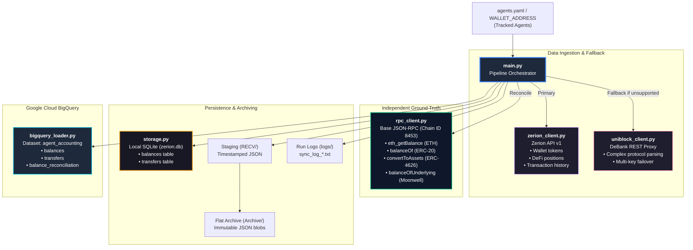
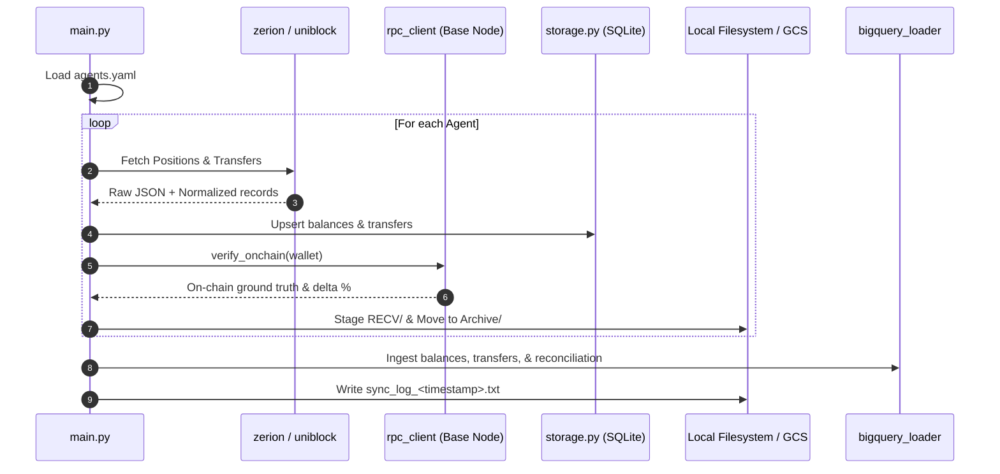

# Core Pipeline & Storage Architecture (Python)

**Location:** `c:\Users\chris\Projects\agent-accounting`  
**Target Environment:** Python 3.12 / GCP Cloud Run / Local PowerShell  
**Primary Focus:** Ingestion, On-Chain Node Verification, Persistence, and Cloud Data Warehouse Loading.

---

## 1. System Overview & Architecture

The Python core pipeline coordinates multi-agent portfolio tracking, reconciles indexed balances against raw on-chain smart contract storage, archives raw API payloads for auditability, and loads clean accounting records into Google BigQuery.



---

## 2. Component Deep-Dives

---

### 2.1. `main.py` — Orchestrator & Execution Engine

[`main.py`](file:///c:/Users/chris/Projects/agent-accounting/main.py) is the system orchestrator. It manages the multi-agent execution loop, isolates errors per agent, stages export payloads, runs the on-chain verification algorithm, and coordinates BigQuery loading.

#### Key Functions:
- `main()`: Entry point. Parses CLI flags, validates API keys, loads [`agents.yaml`](file:///c:/Users/chris/Projects/agent-accounting/agents.yaml), and runs the sequential agent sync pipeline.
- `sync_wallet(client, wallet, chain_ids, storage, ...)`: Fetches positions and transfers from Zerion, normalizes records, and writes to SQLite.
- `verify_onchain(...)`: Compares stored/indexed balances against live contract storage queried via `rpc_client.py`.
- `export_json(storage, wallet, run_dir, timestamp)`: Dumps processed `balances` and `transfers` tables from SQLite to JSON files.
- `export_raw(raw_txs, raw_positions, run_dir, timestamp)`: Saves untouched upstream API responses for forensic auditability.
- `move_to_archive(run_dir, archive_dir, agent_prefix)`: Flattens staged JSON files into the immutable archive directory with standard naming.
- `write_run_log(logs_dir, timestamp, summary_entries, reconciliations)`: Emits human-readable sync report (`logs/sync_log_<ts>.txt`).

#### CLI Parameters:
```text
--wallet            Track a single wallet address (bypasses agents.yaml)
--agents-config     Path to agents config (default: agents.yaml, env: AGENTS_CONFIG)
--chain-ids         Comma-separated chains to sync (default: base, env: CHAIN_IDS)
--output-dir        Staging directory for exports (default: ./RECV)
--archive-dir       Final archive directory (default: ./Archive)
--logs-dir          Directory for sync logs (default: ./logs)
--bq-dataset        BigQuery dataset ID (default: agent_accounting, env: BQ_DATASET)
--bq-project        BigQuery GCP Project ID (env: BQ_PROJECT)
--skip-bq           Flag to disable BigQuery loading
--skip-uniblock     Flag to disable DeBank fallback
--skip-rpc          Flag to disable Base JSON-RPC verification
--db-path           Path to SQLite database file (default: zerion.db)
```

---

### 2.2. `rpc_client.py` — Base JSON-RPC Client

[`rpc_client.py`](file:///c:/Users/chris/Projects/agent-accounting/rpc_client.py) connects directly to Base nodes (`https://api.uniblock.dev/uni/v1/json-rpc?chainId=8453`) to establish an independent ground-truth layer.

#### Key Capabilities:
- **Zero-Downtime Key Failover:** Parses `UNIBLOCK_API_KEY` and `UNIBLOCK_API_KEY_BACKUP`. On HTTP `429`, `401`, or `403`, automatically switches headers to the working backup key.
- **Connection Pooling & Retry Strategy:** Mounts custom `urllib3.util.retry.Retry` adapter with exponential backoff on `500/502/503/504` errors.
- **Pacing Control:** Built-in `rate_limit_delay` (default `0.15s`) prevents burst rate-limiting.

#### On-Chain Method Signatures:
```python
def get_block_number(self) -> int:
    """Reads latest Base block height via eth_blockNumber."""

def get_eth_balance(self, wallet: str, block: str = "latest") -> int:
    """Native ETH balance in wei via eth_getBalance."""

def get_erc20_balance(self, token: str, wallet: str, block: str = "latest") -> int:
    """ERC-20 token balance via eth_call balanceOf(address)."""

def get_vault_assets(self, vault: str, wallet: str, block: str = "latest") -> tuple[int, int]:
    """ERC-4626 vault positions: returns (shares, underlying_assets_raw)
    via convertToAssets(shares) for Morpho, Steakhouse, Clearstar, Euler."""

def get_balance_of_underlying(self, market: str, wallet: str, block: str = "latest") -> int:
    """Moonwell/Compound-fork money market balance in underlying tokens."""

def get_markets(self, comptroller: str, block: str = "latest") -> list[tuple[str, str | None]]:
    """Resolves and caches Moonwell Comptroller markets via getAllMarkets()."""
```

---

### 2.3. `zerion_client.py` — Zerion REST API Client

[`zerion_client.py`](file:///c:/Users/chris/Projects/agent-accounting/zerion_client.py) wraps Zerion's v1 REST API (`https://api.zerion.io/v1`). It handles HTTP Basic authentication, pagination cursors, and rate-limit backoff.

#### Methods & Generators:
- `get_wallet_portfolio(wallet)`: Total portfolio valuation and per-chain USD distribution.
- `get_positions(wallet)`: Generator yielding parsed wallet tokens, staked assets, and vault positions.
- `get_transactions(wallet)`: Generator iterating through transaction history and individual transfer legs.
- `get_raw_positions(wallet)`: Collects raw unparsed API position pages for audit staging.
- `get_raw_transactions(wallet)`: Collects raw unparsed API transaction pages for audit staging.

---

### 2.4. `uniblock_client.py` — DeBank REST Proxy Client

[`uniblock_client.py`](file:///c:/Users/chris/Projects/agent-accounting/uniblock_client.py) communicates with DeBank Open API via Uniblock's direct proxy (`https://api.uniblock.dev/direct/v1/DeBank`).

#### Purpose & Capabilities:
- Serves as the primary data provider for wallets that Zerion cannot index.
- Resolves complex nested protocol positions (e.g. liquidity pools, reward vesting contracts, lending collaterals).
- Shares the automated multi-key failover engine with `rpc_client.py`.

#### Core Methods:
- `get_total_balance(wallet)`: High-level USD portfolio balance.
- `get_all_token_list(wallet, is_all=True)`: Full list of tokens held across all supported chains.
- `get_complex_protocol_list(wallet, chain_ids="base")`: Deep protocol breakdown (pools, supplies, borrowings, rewards).
- `get_all_history_list(wallet, chain_ids, page_count)`: Cross-chain transaction history.

---

### 2.5. `storage.py` — Local Persistence Engine

[`storage.py`](file:///c:/Users/chris/Projects/agent-accounting/storage.py) encapsulates SQLite database operations (`zerion.db`).

#### Database Schema:

##### 1. `balances` Table
Stores current position snapshots per agent and token:
```sql
CREATE TABLE IF NOT EXISTS balances (
    id INTEGER PRIMARY KEY AUTOINCREMENT,
    agent_name TEXT,
    wallet TEXT NOT NULL,
    chain TEXT,
    token_address TEXT,
    token_name TEXT,
    token_symbol TEXT,
    decimals INTEGER,
    balance_raw TEXT,
    balance_float REAL,
    price REAL,
    usd_value REAL,
    is_receipt_token BOOLEAN DEFAULT 0,
    position_type TEXT,
    protocol TEXT,
    timestamp TEXT NOT NULL,
    provider TEXT DEFAULT 'zerion',
    UNIQUE(wallet, chain, token_address, position_type, protocol)
);
```

##### 2. `transfers` Table
Stores normalized transaction transfer records:
```sql
CREATE TABLE IF NOT EXISTS transfers (
    id INTEGER PRIMARY KEY AUTOINCREMENT,
    wallet TEXT NOT NULL,
    agent_name TEXT,
    transfer_id TEXT UNIQUE NOT NULL,
    tx_hash TEXT,
    chain TEXT,
    block_timestamp TEXT,
    direction TEXT,
    sender TEXT,
    recipient TEXT,
    fungible_id TEXT,
    token_name TEXT,
    token_symbol TEXT,
    token_address TEXT,
    token_chain TEXT,
    decimals INTEGER,
    amount_raw TEXT,
    amount_float REAL,
    price REAL,
    usd_value REAL,
    provider TEXT DEFAULT 'zerion'
);
```

---

### 2.6. `bigquery_loader.py` — Cloud Data Warehouse Ingestion

[`bigquery_loader.py`](file:///c:/Users/chris/Projects/agent-accounting/bigquery_loader.py) handles batch ingestion into Google Cloud BigQuery dataset `agent_accounting`.

#### Destination Tables:
1. **`agent_accounting.balances`**: Historical record of all balance snapshots partitioned by date.
2. **`agent_accounting.transfers`**: Full transaction ledger across all tracked wallets.
3. **`agent_accounting.balance_reconciliation`**: High-level audit logs containing:
   - `run_timestamp`: Execution ID (e.g. `20260920_120124`).
   - `agent_name`: Name of tracked agent.
   - `wallet`: Address of the agent.
   - `provider`: Primary provider used (`zerion` or `debank`).
   - `stored_total_usd`: Total value computed from stored rows.
   - `onchain_total_usd`: Ground truth computed from Base JSON-RPC.
   - `delta_pct`: Variance percentage.
   - `status`: Verdict (`OK` or `MISMATCH`).
   - `recorded_at`: Ingestion timestamp.

---

## 3. Data Flow & Execution Sequence



---

## 4. Environment Variables Reference

| Variable | Required | Description |
| :--- | :--- | :--- |
| `ZERION_API_KEY` | **Yes** | Zerion API v1 key for wallet & position indexing |
| `UNIBLOCK_API_KEY` | **Yes** | Primary key for DeBank proxy and Base JSON-RPC verification |
| `UNIBLOCK_API_KEY_BACKUP` | Optional | Secondary Uniblock key for automatic failover |
| `AGENTS_CONFIG` | Optional | Custom path to agents YAML (default: `agents.yaml`) |
| `CHAIN_IDS` | Optional | Target chains (default: `base`) |
| `BQ_DATASET` | Optional | BigQuery dataset name (default: `agent_accounting`) |
| `BQ_PROJECT` | Optional | BigQuery GCP Project ID (default: `agent-accounting-506719`) |
