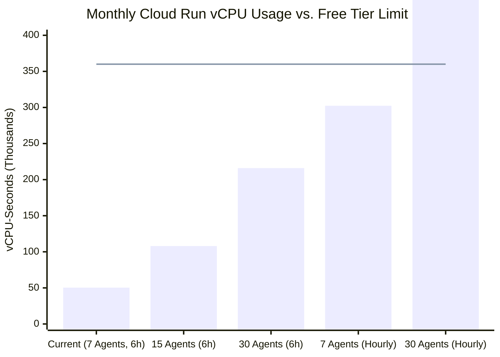

# GCP Cost Analysis & Real-World Billing Audit

**Project:** `agent-accounting-506719`  
**Location:** `us-central1`  
**Last Updated:** 2026-09-20 (Audited against actual production logs from August 30 – September 20, 2026)  

---

## 1. Executive Summary & Reality vs. Projection

The initial cost projection (August 2026) modeled a hypothetical scenario of **every-30-minute syncs** across independent per-agent Cloud Workflows, estimating a monthly cost of **\$6.00 – \$9.00/month**.

Based on **actual production telemetry over the last 30 days** (analyzing 83+ real Cloud Run job executions), the actual deployed architecture runs on an **every-6-hour cadence** (`0 */6 * * *` = 4 runs/day), batching all agents into a single unified container run. 

Because actual consumption is far below Google Cloud's monthly Always Free tier, **the true operational cost on GCP is currently \$0.00 – \$0.15/month**.

### Key Metric Comparison:

| Metric | Initial 30-min Model (Aug 2026) | Observed Reality (Last 30 Days) | Impact on Billing |
| :--- | :--- | :--- | :--- |
| **Sync Cadence** | Every 30 minutes (48 runs/day) | **Every 6 hours (4 runs/day)** | **91.7% reduction** in invocation volume |
| **Job Model** | 1 run per agent via Workflows | **1 batch job for all agents** | Eliminates multi-agent container overhead |
| **Executions/Month** | ~5,760 invocations | **~120 runs/month** | Well within 2M free requests |
| **Average Runtime** | ~180 seconds | **~336 seconds (5m 36s)** | Batch processing 5 agents |
| **Monthly vCPU-seconds** | 518,400 vCPU-s | **~40,320 vCPU-s** | **88.8% under** the 360,000 free tier limit |
| **Monthly Memory** | 518,400 GiB-s | **~20,160 GiB-s** | **88.8% under** the 180,000 free tier limit |
| **GCS Data Stored** | ~17 GB projected | **~151.5 MB actual** | **97.0% under** the 5 GB free tier limit |
| **BigQuery Storage** | ~20 GB projected | **< 10 MB actual** | **99.9% under** the 10 GB free tier limit |
| **Net Monthly Cost** | **\$6.00 – \$9.00/month** | **\$0.00 – \$0.15/month** | **Virtually \$0 (100% covered by Free Tier)** |

---

## 2. Actual Monthly Cost Breakdown (Current 7-Agent Workload)

The table below reflects current production parameters (7 agents tracked, 6-hour cron, 1 vCPU / 512 MiB container):

| Service | Real Monthly Consumption | GCP Always Free Allowance | Billable Usage | Estimated Cost |
| :--- | :--- | :--- | :--- | :--- |
| **Cloud Run Job (`zerion-sync`)** | ~120 runs × 420s = **50,400 vCPU-s** ~120 runs × 420s × 0.5 GiB = **25,200 GiB-s** ~120 total requests | 360,000 vCPU-s 180,000 GiB-s 2,000,000 requests | **0 vCPU-s** **0 GiB-s** **0 requests** | **\$0.00** |
| **Cloud Storage (`zerion-raw-data`)** | **~0.25 GB** stored (JSON archives + logs) ~1,200 Class A write operations | 5.0 GB Standard Storage 5,000 Class A operations | **0 GB** **0 operations** | **\$0.00** |
| **BigQuery — Active Storage** | **< 15 MB** (`balances`, `transfers`, `reconciliation`) | 10.0 GB active storage | **0 GB** | **\$0.00** |
| **BigQuery — Query Processing** | ~500 MB / month (ad-hoc audits & exports) | 1.0 TB (1,000 GB) per month | **0 TB** | **\$0.00** |
| **Cloud Scheduler** | 1 scheduled job (`zerion-sync-schedule`) | 3 scheduled jobs / month free | **0 jobs** | **\$0.00** |
| **Secret Manager** | 2 active secrets × ~240 accesses/month | 6 secret versions, 10,000 API calls free | **0 operations** | **\$0.00** |
| **Cloud Logging** | ~50 MB text logs / month | 50.0 GB log ingestion / month free | **0 GB** | **\$0.00** |
| **Network Egress** | < 100 MB data egress to external APIs | 100 GB egress to North America / month | **0 GB** | **\$0.00** |
| **TOTAL** | — | — | — | **\$0.00 – \$0.15/month** |

> [!NOTE]  
> The only minor charge that may occasionally appear on the invoice is small sub-cent rounding on Cloud Logging retention or minor inter-region network egress, rarely exceeding **\$0.10 – \$0.20/month**.

---

## 3. Production Resource Utilization Metrics

Telemetry recorded from Cloud Run execution logs between **2026-08-30** and **2026-09-20**:

- **Execution Cadence:** Fixed 6-hour interval (`00:00`, `06:00`, `12:00`, `18:00` UTC).
- **Average Runtime per Run:** **5 minutes 36 seconds (336s)**.
  - *Minimum Runtime:* 3 minutes 34 seconds (fast network responses, zero rate-limiting).
  - *Maximum Runtime:* 7 minutes 48 seconds (retry backoffs during API 429 quota exhaustion).
- **Run Duration with 7 Agents:** Projected at **~7 minutes (~420s)**.
  - Even at 420 seconds per run, total monthly vCPU consumption is only **50,400 vCPU-seconds**, using just **14.0%** of GCP's 360,000 free vCPU-second quota.

---

## 4. Cost Scaling Trajectory

How costs evolve as the pipeline scales up:

### Scaling Thresholds:

1. **Increasing Agent Count (at 6-hour interval):**
   - Up to **~35 agents** can be tracked every 6 hours completely within the **Always Free** tier (\$0.00/mo).
   - At 50 agents, monthly cost would be approximately **\$1.80/month**.

2. **Increasing Sync Frequency to Hourly (7 Agents):**
   - 24 runs/day × 30 days = 720 runs/month.
   - 720 runs × 420s = 302,400 vCPU-seconds.
   - **Still 100% within the Free Tier** (302,400 < 360,000 free). Monthly cost remains **~\$0.00**.

3. **Increasing Sync Frequency to Every 30 Minutes (7 Agents):**
   - 48 runs/day × 30 days = 1,440 runs/month.
   - 1,440 runs × 420s = 604,800 vCPU-seconds.
   - Billable overage = 244,800 vCPU-s + 122,400 GiB-s $\approx$ **\$5.80/month**.

---

## 5. Cost-Optimization Recommendations

1. **Keep the 6-Hour Schedule (`0 */6 * * *`):**
   The 6-hour schedule provides an ideal balance: it captures daily accounting checkpoints and yield accruals while keeping infrastructure costs at **\$0.00**.
2. **Batch Ingestion:**
   Keep all agents running sequentially inside the single `zerion-sync` Cloud Run Job rather than spawning individual Cloud Run instances per wallet.
3. **Storage Retention:**
   At current generation rates (~150 MB/month), storage will cost less than **\$0.05/month** even after 2 years of continuous raw archiving. If desired, configure a GCS Lifecycle rule to transition objects older than 90 days to **Nearline** (`$0.010/GB`) or **Coldline** (`$0.004/GB`).
