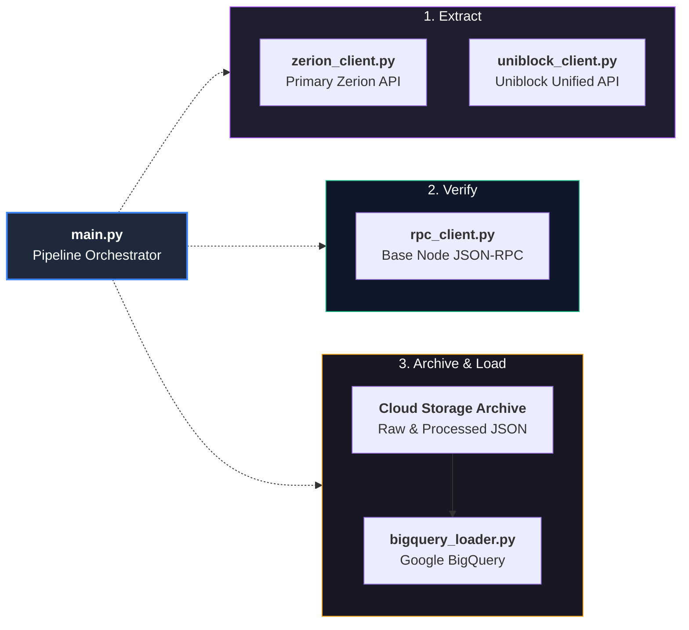

# ETL Pipeline Scripts Reference (`docs/etl/`)

This directory contains standalone technical documentation for every individual Python script that powers the Agent Accounting ETL pipeline.

---

## 🚀 Production ETL Pipeline Architecture

> [!NOTE]  
> The production pipeline streams data to Cloud Storage and BigQuery. The [`storage.py`](storage.md) SQLite engine is used exclusively for offline local development and debugging (see [**Local Testing & Development Guide**](../local_testing_and_development.md)).

---

## Quick Navigation Index

| Script | Role | Stage | Documentation Link |
| :--- | :--- | :--- | :--- |
| [`main.py`](file:///c:/Users/chris/Projects/agent-accounting/main.py) | **Orchestrator** | Coordination & CLI | [**`main.md`**](main.md) |
| [`zerion_client.py`](file:///c:/Users/chris/Projects/agent-accounting/zerion_client.py) | **Primary Ingestion** | Extract (Zerion API) | [**`zerion_client.md`**](zerion_client.md) |
| [`uniblock_client.py`](file:///c:/Users/chris/Projects/agent-accounting/uniblock_client.py) | **Fallback Ingestion** | Extract (Uniblock Unified API) | [**`uniblock_client.md`**](uniblock_client.md) |
| [`rpc_client.py`](file:///c:/Users/chris/Projects/agent-accounting/rpc_client.py) | **On-Chain Verification** | Ground Truth Verify | [**`rpc_client.md`**](rpc_client.md) |
| [`storage.py`](file:///c:/Users/chris/Projects/agent-accounting/storage.py) | **Local Persistence** | Local SQLite Staging | [**`storage.md`**](storage.md) |
| [`bigquery_loader.py`](file:///c:/Users/chris/Projects/agent-accounting/bigquery_loader.py) | **Cloud Data Warehouse** | BigQuery Loading | [**`bigquery_loader.md`**](bigquery_loader.md) |

---

## System Architecture Guide

For the full architectural breakdown connecting all scripts together, see:
👉 [**Core Pipeline Architecture Guide (`docs/core_pipeline_and_storage.md`)**](../core_pipeline_and_storage.md)
