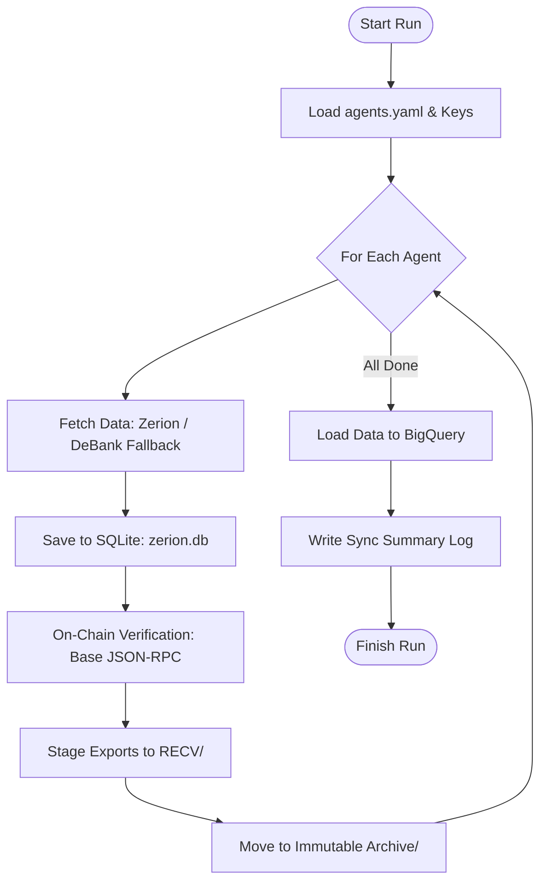

# ETL Script: `main.py`

**Source File:** [`main.py`](file:///c:/Users/chris/Projects/agent-accounting/main.py)  
**Role:** Pipeline Orchestrator & CLI Runner  
**Language:** Python 3.12  

---

## 1. Overview

`main.py` is the execution orchestrator for the entire agent accounting pipeline. It loads tracked wallets from `agents.yaml`, fetches token balances and transaction transfers from primary and fallback data providers, reconciles values against Base blockchain node ground truth, stages and archives raw payloads, and triggers BigQuery data warehouse ingestion.



---

## 2. CLI Options & Parameters

| Flag | Type | Default | Description |
| :--- | :--- | :--- | :--- |
| `--wallet` | String | *None* | Sync a single wallet address (bypasses `agents.yaml`). |
| `--agents-config` | Path | `agents.yaml` | Path to agents YAML configuration file (env: `AGENTS_CONFIG`). |
| `--chain-ids` | String | `base` | Comma-separated EVM chains to sync (env: `CHAIN_IDS`). |
| `--output-dir` | Path | `./RECV` | Temporary staging directory for generated JSON files. |
| `--archive-dir` | Path | `./Archive` | Final destination directory for permanent JSON archives. |
| `--logs-dir` | Path | `./logs` | Directory for per-run summary text reports. |
| `--bq-dataset` | String | `agent_accounting`| BigQuery dataset name (env: `BQ_DATASET`). |
| `--bq-project` | String | *Auto-detected* | Google Cloud Project ID for BigQuery. |
| `--skip-bq` | Flag | `False` | Skip loading records into BigQuery. |
| `--skip-uniblock`| Flag | `False` | Disable DeBank fallback when Zerion fails. |
| `--skip-rpc` | Flag | `False` | Skip on-chain JSON-RPC node balance verification. |
| `--db-path` | Path | `zerion.db` | Local SQLite database file path. |
| `--rate-limit-delay`| Float | `0.25` | Sleep delay in seconds between consecutive API calls. |
| `--full-resync` | Flag | `False` | Truncate transfer tables and re-fetch entire history. |

---

## 3. Core Workflow Steps

### Step 1: Configuration & Key Initialization
- Validates `ZERION_API_KEY`, `UNIBLOCK_API_KEY`, and optional `UNIBLOCK_API_KEY_BACKUP`.
- Reads agent names and addresses from `agents.yaml` (or fallback `WALLET_ADDRESS`).

### Step 2: Per-Agent Extraction Loop
For each agent:
1. **Primary Indexing (`zerion_client.py`):** Queries current portfolio positions and paginated ERC-20 transfers.
2. **Fallback Indexing (`uniblock_client.py`):** If Zerion returns an error (e.g. 400 Unsupported Address), falls back to DeBank proxy via Uniblock.
3. **Local Staging (`storage.py`):** Upserts balances and transfer records into local SQLite database.

### Step 3: On-Chain Ground Truth Verification (`verify_onchain`)
- Calls `rpc_client.py` to query Base smart contracts directly.
- Compares stored balance vs. contract balance.
- Computes percentage delta and assigns verdict:
  - `OK`: Delta within tolerance ($\le 5.0\%$).
  - `MISMATCH`: Delta exceeds tolerance ($> 5.0\%$).

### Step 4: Staging & Permanent Archiving
- Dumps database tables into timestamped JSON files in `--output-dir` (`RECV/`).
- Moves all staged JSON files into `--archive-dir` (`Archive/`) with standard prefix naming.

### Step 5: BigQuery Ingestion & Reporting
- Invokes `bigquery_loader.py` to stream new rows into BigQuery tables: `balances`, `transfers`, and `balance_reconciliation`.
- Writes a run summary text log into `logs/sync_log_<timestamp>.txt`.

---

## 4. Execution Examples

```bash
# 1. Standard Production Run
python main.py

# 2. Sync Single Wallet Locally without BigQuery
python main.py --wallet 0x6a9e4e59df3e65fdb6a2f8d1ab6f0cd3943c015b --skip-bq

# 3. Custom Archive and Logs Destinations
python main.py --output-dir ./tmp_recv --archive-dir ./data_archive --logs-dir ./run_logs
```
