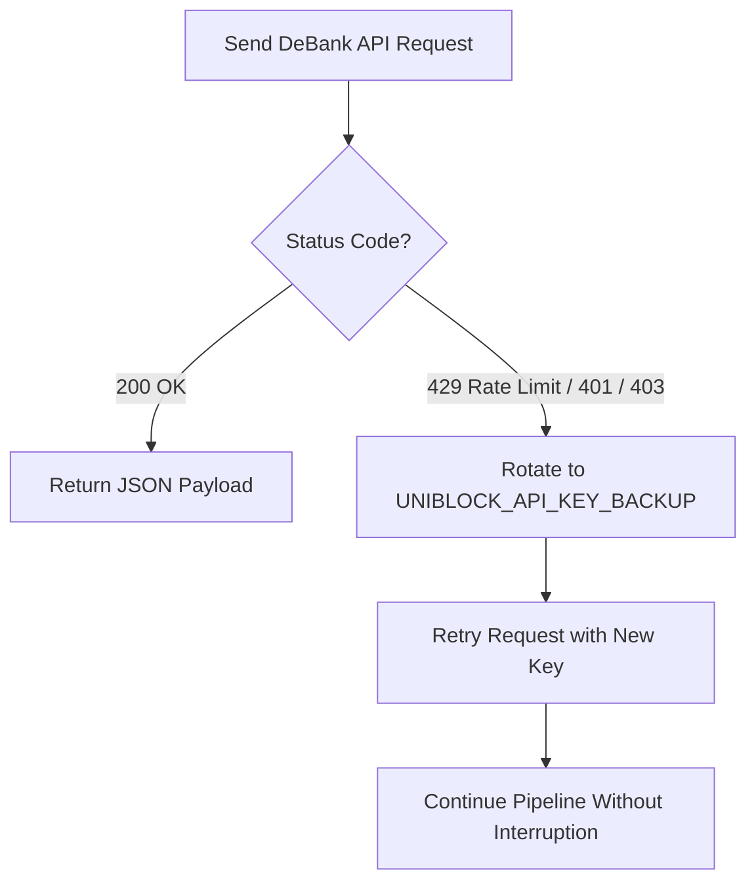

# ETL Script: `uniblock_client.py`

**Source File:** [`uniblock_client.py`](file:///c:/Users/chris/Projects/agent-accounting/uniblock_client.py)  
**Role:** Fallback Data Extraction (DeBank Open API via Uniblock Proxy)  
**Language:** Python 3.12  

---

## 1. Overview

`uniblock_client.py` connects to the DeBank Open API through Uniblock's managed proxy gateway (`https://api.uniblock.dev/direct/v1/DeBank`). It is activated when Zerion cannot index a wallet (e.g. smart contracts, multi-sigs, or unindexed accounts).

---

## 2. API Endpoints Used

| Endpoint | Method | Purpose in Pipeline |
| :--- | :--- | :--- |
| `/user/total_balance` | `GET` | Fetches overall portfolio net worth across all supported chains. |
| `/user/all_token_list` | `GET` | Retrieves all native and ERC-20 token balances held in the wallet. |
| `/user/complex_protocol_list` | `GET` | Resolves complex DeFi positions: lending deposits, borrowed assets, liquidity pools, and unclaimed reward tokens. |
| `/user/all_history_list` | `GET` | Fetches cross-chain transaction history. |

---

## 3. Dual-Key Failover Engine

`uniblock_client.py` includes an automated zero-downtime failover engine:

#### Failover Details:
- Supports primary (`UNIBLOCK_API_KEY`) and backup (`UNIBLOCK_API_KEY_BACKUP`) API tokens.
- When an API key hits rate limits (`429`) or quota exhaustion (`401/403`), the client updates `self.session.headers["x-api-key"]` on the fly and immediately retries the request.

---

## 4. Key Methods & Class Interface

### `UniblockClient(api_key, backup_api_key, rate_limit_delay)`

- **`get_total_balance(wallet: str) -> float`**  
  Returns high-level USD valuation from DeBank.

- **`get_all_token_list(wallet: str, is_all: bool = True) -> list[dict]`**  
  Returns raw token list across chains.

- **`get_complex_protocol_list(wallet: str, chain_ids: str = "base") -> list[dict]`**  
  Parses nested protocol structures (Morpho, Moonwell, Uniswap, Aerodrome) and extracts supply balances, debt balances, and reward tokens.

- **`get_all_history_list(wallet: str, chain_ids: str = "base", page_count: int = 20) -> list[dict]`**  
  Retrieves transfer history for the wallet.
