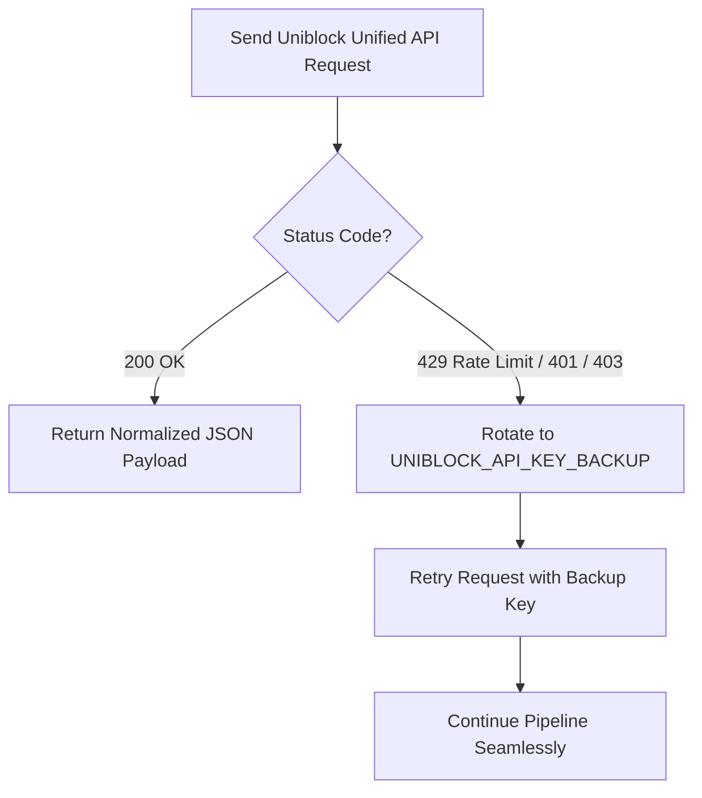

# ETL Script: `uniblock_client.py`

**Source File:** [`uniblock_client.py`](file:///c:/Users/chris/Projects/agent-accounting/uniblock_client.py)  
**Role:** Fallback Data Extraction (Uniblock Unified API)  
**Language:** Python 3.12  

---

## 1. Overview

`uniblock_client.py` connects to the **Uniblock Unified API** (`https://api.uniblock.dev/`). 

Uniblock provides a unified abstraction layer that aggregates and standardizes data across underlying Web3 data providers and DeFi protocols. This client serves as the robust fallback extraction engine when primary indexers (like Zerion) cannot index an agent's address (such as smart contracts, newly created accounts, or multi-sigs).

---

## 2. API Endpoints Used

The client queries Uniblock's unified data endpoints:

| Endpoint | Method | Purpose in Pipeline |
| :--- | :--- | :--- |
| `/user/total_balance` | `GET` | Fetches overall portfolio net worth across all supported chains. |
| `/user/all_token_list` | `GET` | Retrieves all native and ERC-20 token balances held in the wallet. |
| `/user/complex_protocol_list` | `GET` | Resolves complex DeFi positions: lending deposits, borrowed assets, liquidity pools, and unclaimed reward tokens. |
| `/user/all_history_list` | `GET` | Fetches cross-chain transaction and transfer history. |

---

## 3. Dual-Key Failover Engine

`uniblock_client.py` features an automated zero-downtime key rotation mechanism:

#### Failover Details:
- Reads both `UNIBLOCK_API_KEY` (primary) and `UNIBLOCK_API_KEY_BACKUP` (secondary).
- If the primary key is rate-limited (`429`) or unauthorized (`401/403`), the client dynamically switches the `x-api-key` header to the backup key and transparently retries the request without failing the agent sync.

---

## 4. Key Methods & Class Interface

### `UniblockClient(api_key, backup_api_key, rate_limit_delay)`

- **`get_total_balance(wallet: str) -> float`**  
  Returns high-level USD valuation unified across chains.

- **`get_all_token_list(wallet: str, is_all: bool = True) -> list[dict]`**  
  Returns unified token balances.

- **`get_complex_protocol_list(wallet: str, chain_ids: str = "base") -> list[dict]`**  
  Extracts nested protocol positions (Morpho, Moonwell, Uniswap, Aerodrome) into standardized supply balances, debt balances, and reward tokens.

- **`get_all_history_list(wallet: str, chain_ids: str = "base", page_count: int = 20) -> list[dict]`**  
  Retrieves standardized transaction history.
