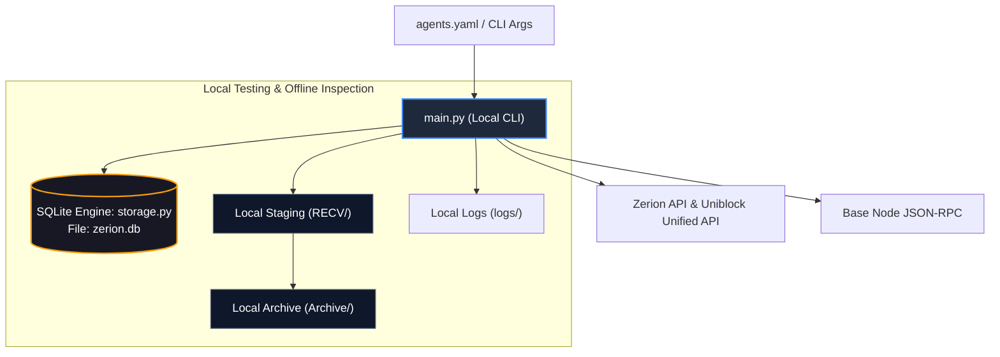

# Local Testing & Development Guide

**Location:** `c:\Users\chris\Projects\agent-accounting`  
**Purpose:** Guide for local execution, offline debugging, unit testing, and SQLite inspection.

---

## 1. Overview

While the production pipeline runs in Google Cloud Run (exporting directly to Google Cloud Storage and BigQuery), the repository provides a complete local development and testing environment. 

Local execution enables developers to:
- Test API integrations without cloud infrastructure (`--skip-bq`).
- Inspect structured data locally using an embedded SQLite database (`zerion.db`).
- Verify Base JSON-RPC queries using interactive diagnostic tools.
- Run automated pytest unit suites with mock failover scenarios.

---

## 2. Local Architecture & Testing Flow



> [!NOTE]  
> In GCP production Cloud Run runs, data is written directly to mounted Google Cloud Storage buckets and ingested into BigQuery. Local SQLite (`zerion.db`) is strictly used for offline staging, local inspection, and development.

---

## 3. Local SQLite Database (`zerion.db`)

When executing locally, [`storage.py`](etl/storage.md) creates a local SQLite database named `zerion.db` (or custom path via `--db-path`).

### Inspecting Local Tables:
You can query `zerion.db` using any SQLite browser or the CLI:

```bash
# 1. View current token balances across all agents
sqlite3 zerion.db "SELECT agent_name, token_symbol, balance_float, usd_value FROM balances ORDER BY usd_value DESC;"

# 2. View recent transfer events
sqlite3 zerion.db "SELECT agent_name, direction, token_symbol, amount_float, usd_value FROM transfers ORDER BY id DESC LIMIT 10;"

# 3. Check vault / receipt share tokens only
sqlite3 zerion.db "SELECT agent_name, token_name, balance_float, usd_value FROM balances WHERE is_receipt_token = 1;"
```

---

## 4. Running the Pipeline Locally

### 4.1. Dry Run / Local Sync (Skipping BigQuery)
To test syncing all agents locally without needing Google Cloud credentials:
```bash
python main.py --skip-bq
```

### 4.2. Testing a Single Agent Wallet
To isolate and debug a specific wallet:
```bash
python main.py --wallet 0x6a9e4e59df3e65fdb6a2f8d1ab6f0cd3943c015b --skip-bq
```

### 4.3. Custom Local Directories
```bash
python main.py --output-dir ./test_recv --archive-dir ./test_archive --db-path ./test.db --skip-bq
```

---

## 5. Diagnostic CLI Utilities

The repo provides standalone scripts to test specific pipeline components in isolation:

### 5.1. Probe APIs Directly: `demo_fetch.py`
Inspects what Zerion and Uniblock Unified API return for an agent without touching SQLite or files:
```bash
# Probe all agents in agents.yaml
python demo_fetch.py

# Probe a single wallet
python demo_fetch.py --wallet 0x6a9e4e59df3e65fdb6a2f8d1ab6f0cd3943c015b
```

### 5.2. Direct Base Node Query: `demo_rpc_reader.py`
Directly queries the Base JSON-RPC endpoint to inspect raw smart contract state (ETH, ERC-20 tokens, Morpho vaults, and Moonwell lending):
```bash
# Query default test wallet
python demo_rpc_reader.py

# Query custom wallet
python demo_rpc_reader.py --wallet 0x3de51ddb55ffec013f428288559dd993e9eeb6b6
```

---

## 6. Automated Unit Testing (`pytest`)

The automated unit test suite is located in [`test_sync.py`](file:///c:/Users/chris/Projects/agent-accounting/test_sync.py) and covers 12 isolated test cases:
- Dual-key rotation and failover on HTTP 429 in Uniblock and RPC clients.
- Multi-agent error isolation.
- SQLite upsert logic and duplicate prevention.
- JSON file staging, flattening, and archiving.
- Balance reconciliation delta calculations.

### Run Unit Tests:
```bash
pytest test_sync.py -v
```
