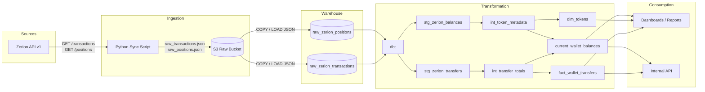

# Zerion Data Pipeline Architecture

End-to-end flow: **Zerion API → S3 (raw) → Supabase (raw tables) → dbt (transformed models)**.

## High-level Diagram



## Stage-by-Stage Breakdown

### 1. Extract & Land Raw (Zerion API → S3)

The existing Python sync script fetches paginated responses from:

- `GET /v1/wallets/{wallet}/transactions/`
- `GET /v1/wallets/{wallet}/positions/`

Each page is saved **as-is** (raw JSON) to S3 without transformation. This preserves the original API contract and makes the pipeline reproducible.

**Suggested S3 key layout:**

```text
s3://zerion-raw-data/
  wallet_address=0xbf96.../
    entity=transactions/
      year=2026/month=08/day=25/
        run_2026-08-25T14-30-00Z_page_000.json
        run_2026-08-25T14-30-00Z_page_001.json
    entity=positions/
      year=2026/month=08/day=25/
        run_2026-08-25T14-30-00Z_page_000.json
```

**Why S3 first?**

- Cheap, durable raw storage.
- Decouples ingestion from loading/transforming.
- Easy to replay or re-load historical data.
- Keeps Supabase load jobs idempotent.

### 2. Load Raw into Supabase (S3 → Raw Tables)

Create two raw tables in Supabase. Using `JSONB` lets you query the raw payload directly and still build indexes on hot keys.

```sql
CREATE TABLE raw_zerion_transactions (
    id BIGSERIAL PRIMARY KEY,
    wallet_address TEXT NOT NULL,
    run_timestamp TIMESTAMPTZ NOT NULL DEFAULT NOW(),
    page_index INT NOT NULL,
    payload JSONB NOT NULL,
    loaded_at TIMESTAMPTZ NOT NULL DEFAULT NOW()
);

CREATE TABLE raw_zerion_positions (
    id BIGSERIAL PRIMARY KEY,
    wallet_address TEXT NOT NULL,
    run_timestamp TIMESTAMPTZ NOT NULL DEFAULT NOW(),
    page_index INT NOT NULL,
    payload JSONB NOT NULL,
    loaded_at TIMESTAMPTZ NOT NULL DEFAULT NOW()
);

CREATE INDEX idx_raw_tx_wallet ON raw_zerion_transactions(wallet_address);
CREATE INDEX idx_raw_tx_run ON raw_zerion_transactions(run_timestamp);
CREATE INDEX idx_raw_pos_wallet ON raw_zerion_positions(wallet_address);
CREATE INDEX idx_raw_pos_run ON raw_zerion_positions(run_timestamp);
```

**Loading options:**

| Approach | When to use |
|----------|-------------|
| **Supabase Storage** + `pg_read_file` / `aws_s3` extension | Files already in S3; load via SQL |
| **External loader** (Python script with `psycopg2`) | You want full control over batching/upserts |
| **dbt external tables** (`dbt-external-tables`) | You want dbt to manage the S3 → warehouse mapping |

For a simple start, a Python loader that reads S3 JSON files and inserts them into the raw tables is easiest.

### 3. Transform with dbt (Raw Tables → Models)

Use dbt to unpack the JSONB payloads into typed, normalized tables.

**dbt project structure:**

```text
dbt_zerion/
├── models/
│   ├── sources.yml              # declares raw_zerion_transactions, raw_zerion_positions
│   ├── staging/
│   │   ├── stg_zerion_transfers.sql
│   │   └── stg_zerion_balances.sql
│   ├── intermediate/
│   │   ├── int_transfer_totals.sql
│   │   └── int_token_metadata.sql
│   └── marts/
│       ├── fact_wallet_transfers.sql
│       ├── dim_tokens.sql
│       └── current_wallet_balances.sql
├── snapshots/
├── tests/
└── dbt_project.yml
```

**Example source declaration (`models/sources.yml`):**

```yaml
version: 2
sources:
  - name: zerion_raw
    database: your_supabase_db
    schema: public
    tables:
      - name: raw_zerion_transactions
      - name: raw_zerion_positions
```

**Example staging model (`models/staging/stg_zerion_transfers.sql`):**

```sql
WITH source AS (
    SELECT
        wallet_address,
        run_timestamp,
        jsonb_array_elements(payload -> 'data') AS tx
    FROM {{ source('zerion_raw', 'raw_zerion_transactions') }}
),
unpack AS (
    SELECT
        wallet_address,
        run_timestamp,
        tx ->> 'id' AS tx_id,
        tx -> 'attributes' ->> 'hash' AS tx_hash,
        tx -> 'attributes' ->> 'mined_at' AS mined_at,
        transfer ->> 'direction' AS direction,
        transfer -> 'fungible_info' ->> 'id' AS token_id,
        transfer -> 'fungible_info' ->> 'symbol' AS token_symbol,
        (transfer -> 'quantity' ->> 'float')::numeric AS amount_float,
        (transfer ->> 'value')::numeric AS usd_value
    FROM source,
    LATERAL jsonb_array_elements(tx -> 'attributes' -> 'transfers') AS transfer
    WHERE transfer -> 'fungible_info' IS NOT NULL
)
SELECT * FROM unpack
```

### 4. Consume

The marts layer feeds:

- Analytics dashboards (Metabase, Supabase Reports, Streamlit, etc.)
- Internal APIs that return current balances or transfer history
- Alerts / monitoring (e.g., large outgoing transfers)

## Orchestration Options

| Tool | Role |
|------|------|
| **GitHub Actions / cron** | Trigger `python main.py` on a schedule |
| **AWS Lambda** | Run the Python sync serverlessly |
| **Airflow / Dagster** | Orchestrate the full S3 → Supabase → dbt pipeline |
| **Supabase pg_cron** | Schedule dbt runs or loader jobs inside Postgres |

## Suggested Schedule

| Job | Frequency | Notes |
|-----|-----------|-------|
| Zerion API → S3 | Every 15–60 min | Free-plan rate limits may require slower cadence |
| S3 → Supabase raw tables | After each API run | Could be part of the same Python job |
| dbt run | Hourly or after each load | Builds/updates marts |

## Next Steps

1. **Create an S3 bucket** and update the Python script to upload `raw_transactions.json` / `raw_positions.json` instead of (or in addition to) writing locally.
2. **Create the raw tables** in Supabase.
3. **Add a loader step** that copies the S3 files into `raw_zerion_transactions` / `raw_zerion_positions`.
4. **Initialize a dbt project** connected to Supabase and build the staging/marts models.
