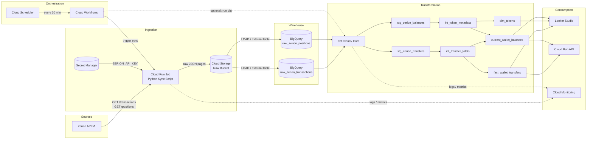

# Zerion Data Pipeline — GCP Edition

End-to-end flow using the Google Cloud suite: **Zerion API → GCS (raw) → BigQuery (raw tables) → dbt (transformed models) → Looker Studio / API**, orchestrated by **Cloud Scheduler + Cloud Workflows** (no Cloud Composer).

## High-level Diagram



## GCP Service Mapping

| Concern | AWS / Supabase version | GCP version |
|---------|------------------------|-------------|
| Object storage | S3 | **Cloud Storage (GCS)** |
| Data warehouse | Supabase Postgres | **BigQuery** |
| Transformation | dbt + Supabase | **dbt + BigQuery** |
| Orchestration | Airflow / GitHub Actions | **Cloud Scheduler + Cloud Workflows** |
| Compute for sync script | EC2 / Lambda | **Cloud Run Jobs** |
| Secrets | env files / AWS SM | **Secret Manager** |
| Monitoring | CloudWatch | **Cloud Monitoring** |
| Dashboards | Metabase / custom | **Looker Studio** |
| API serving | custom | **Cloud Run** |

## Stage-by-Stage Breakdown

### 1. Extract & Land Raw (Zerion API → GCS)

Run the Python sync script as a **Cloud Run Job**. Cloud Run Jobs are perfect for finite batch work: they start, run, and stop, and you pay only for execution time.

**Container:**

```dockerfile
FROM python:3.12-slim
WORKDIR /app
COPY requirements.txt .
RUN pip install -r requirements.txt
COPY . .
CMD ["python", "main.py"]
```

**GCS key layout:**

```text
gs://zerion-raw-data/
  wallet_address=0xbf96.../
    entity=transactions/
      year=2026/month=08/day=25/
        run_2026-08-25T14-30-00Z_page_000.json
        run_2026-08-25T14-30-00Z_page_001.json
    entity=positions/
      year=2026/month=08/day=25/
        run_2026-08-25T14-30-00Z_page_000.json
```

**Upload from Python using `google-cloud-storage`:**

```python
from google.cloud import storage
from datetime import datetime, timezone

bucket = storage.Client().bucket("zerion-raw-data")

def upload_raw(wallet: str, entity: str, page_index: int, payload: bytes):
    ts = datetime.now(timezone.utc).strftime("%Y-%m-%dT%H-%M-%SZ")
    path = (
        f"wallet_address={wallet}/"
        f"entity={entity}/"
        f"year={ts[:4]}/month={ts[5:7]}/day={ts[8:10]}/"
        f"run_{ts}_page_{page_index:03d}.json"
    )
    blob = bucket.blob(path)
    blob.upload_from_string(payload, content_type="application/json")
```

**Secrets:**

Store `ZERION_API_KEY` in **Secret Manager** and mount it as an environment variable in the Cloud Run Job:

```bash
gcloud secrets create zerion-api-key --data-file=.env
```

### 2. Load Raw into BigQuery (GCS → Raw Tables)

BigQuery can read GCS files in two ways:

**Option A: External tables (federated query)**

No copy required; BigQuery reads JSON directly from GCS. Good for exploration, slower for heavy transforms.

```sql
CREATE OR REPLACE EXTERNAL TABLE `project.dataset.raw_zerion_transactions_ext`
OPTIONS (
  format = 'JSON',
  uris = ['gs://zerion-raw-data/wallet_address=*/entity=transactions/*/*.json']
);
```

**Option B: Native tables + LOAD jobs (recommended)**

Load JSON into a native BigQuery table with `JSON` or `STRING` payload column for reliability and query performance.

```sql
CREATE TABLE IF NOT EXISTS `project.dataset.raw_zerion_transactions` (
    wallet_address STRING NOT NULL,
    run_timestamp TIMESTAMP NOT NULL DEFAULT CURRENT_TIMESTAMP(),
    page_index INT64 NOT NULL,
    payload JSON NOT NULL,
    loaded_at TIMESTAMP NOT NULL DEFAULT CURRENT_TIMESTAMP()
)
PARTITION BY DATE(run_timestamp)
CLUSTER BY wallet_address;

CREATE TABLE IF NOT EXISTS `project.dataset.raw_zerion_positions` (
    wallet_address STRING NOT NULL,
    run_timestamp TIMESTAMP NOT NULL DEFAULT CURRENT_TIMESTAMP(),
    page_index INT64 NOT NULL,
    payload JSON NOT NULL,
    loaded_at TIMESTAMP NOT NULL DEFAULT CURRENT_TIMESTAMP()
)
PARTITION BY DATE(run_timestamp)
CLUSTER BY wallet_address;
```

**Python loader using `google-cloud-bigquery`:**

```python
from google.cloud import bigquery
import json

client = bigquery.Client()

def load_raw_table(wallet: str, entity: str, rows: list[dict], table: str):
    # rows: [{page_index, payload, wallet_address, run_timestamp}]
    errors = client.insert_rows_json(table, rows)
    if errors:
        raise RuntimeError(errors)
```

Or use `LOAD DATA` SQL if you prefer bulk loads from GCS:

```sql
LOAD DATA INTO `project.dataset.raw_zerion_transactions`
FROM FILES (
  format = 'JSON',
  uris = ['gs://zerion-raw-data/wallet_address=0x.../entity=transactions/*/*.json']
);
```

### 3. Transform with dbt (BigQuery → Models)

Connect dbt to BigQuery using a service account key.

**`profiles.yml`:**

```yaml
zerion_dbt:
  target: prod
  outputs:
    prod:
      type: bigquery
      method: service-account
      project: your-gcp-project
      dataset: zerion_marts
      threads: 4
      keyfile: /secrets/dbt-service-account.json
      timeout_seconds: 300
      priority: interactive
```

**dbt project structure:**

```text
dbt_zerion/
├── models/
│   ├── sources.yml
│   ├── staging/
│   │   ├── stg_zerion_transfers.sql
│   │   └── stg_zerion_balances.sql
│   ├── intermediate/
│   │   ├── int_transfer_totals.sql
│   │   └── int_token_metadata.sql
│   └── marts/
│       ├── fact_wallet_transfers.sql
│       ├── dim_tokens.sql
│       └── current_wallet_balances.sql
├── snapshots/
├── tests/
├── packages.yml
└── dbt_project.yml
```

**Example source (`models/sources.yml`):**

```yaml
version: 2
sources:
  - name: zerion_raw
    database: your-gcp-project
    schema: zerion_raw
    tables:
      - name: raw_zerion_transactions
      - name: raw_zerion_positions
```

**Example staging model (`models/staging/stg_zerion_transfers.sql`):**

```sql
WITH source AS (
    SELECT
        wallet_address,
        run_timestamp,
        JSON_EXTRACT_ARRAY(payload, '$.data') AS tx_array
    FROM {{ source('zerion_raw', 'raw_zerion_transactions') }}
),
tx_unnested AS (
    SELECT
        wallet_address,
        run_timestamp,
        tx
    FROM source,
    UNNEST(tx_array) AS tx
),
transfers AS (
    SELECT
        wallet_address,
        run_timestamp,
        JSON_EXTRACT_SCALAR(tx, '$.id') AS tx_id,
        JSON_EXTRACT_SCALAR(tx, '$.attributes.hash') AS tx_hash,
        JSON_EXTRACT_SCALAR(tx, '$.attributes.mined_at') AS mined_at,
        JSON_EXTRACT_SCALAR(t, '$.direction') AS direction,
        JSON_EXTRACT_SCALAR(t, '$.fungible_info.id') AS token_id,
        JSON_EXTRACT_SCALAR(t, '$.fungible_info.symbol') AS token_symbol,
        SAFE_CAST(JSON_EXTRACT_SCALAR(t, '$.quantity.float') AS FLOAT64) AS amount_float,
        SAFE_CAST(JSON_EXTRACT_SCALAR(t, '$.value') AS FLOAT64) AS usd_value
    FROM tx_unnested,
    UNNEST(JSON_EXTRACT_ARRAY(tx, '$.attributes.transfers')) AS t
    WHERE JSON_EXTRACT(t, '$.fungible_info') IS NOT NULL
)
SELECT * FROM transfers
```

### 4. Orchestrate with Cloud Scheduler + Cloud Workflows

We use **Cloud Scheduler** as the cron trigger and **Cloud Workflows** as the serverless orchestrator. This avoids the flat ~$250+/month cost of a Cloud Composer environment.

The workflow runs every 30 minutes and:

1. Triggers the Cloud Run Job to sync Zerion data to GCS.
2. Waits for the job to complete.
3. Optionally invokes a BigQuery load or dbt run (via dbt Cloud API or another Cloud Run Job).
4. Logs the result.

**`workflows/zerion_pipeline.yaml`:**

```yaml
main:
  params: [args]
  steps:
    - init:
        assign:
          - project_id: ${sys.get_env("GOOGLE_CLOUD_PROJECT")}
          - location: us-central1
          - job_name: zerion-sync

    - run_sync_job:
        call: googleapis.run.v2.projects.locations.jobs.run
        args:
          name: ${"projects/" + project_id + "/locations/" + location + "/jobs/" + job_name}
        result: sync_result

    - wait_for_job:
        call: googleapis.run.v2.projects.locations.jobs.get
        args:
          name: ${sync_result.metadata.name}
        result: job_state

    - check_done:
        switch:
          - condition: ${job_state.status.conditions[0].type == "Ready"}
            next: finish
          - condition: ${job_state.status.conditions[0].status == "False"}
            next: fail
        next: wait_for_job

    - finish:
        return: ${"Sync completed: " + sync_result.metadata.name}

    - fail:
        raise: ${"Cloud Run Job failed: " + job_state.status.conditions[0].message}
```

**Deploy the workflow:**

```bash
gcloud workflows deploy zerion-pipeline \
  --source=workflows/zerion_pipeline.yaml \
  --location=us-central1
```

**Schedule it with Cloud Scheduler:**

```bash
gcloud scheduler jobs create http zerion-pipeline-30min \
  --schedule="*/30 * * * *" \
  --time-zone=UTC \
  --location=us-central1 \
  --uri="https://workflowexecutions.googleapis.com/v1/projects/your-gcp-project/locations/us-central1/workflows/zerion-pipeline/executions" \
  --http-method=POST \
  --oauth-service-account-email=zerion-scheduler@your-gcp-project.iam.gserviceaccount.com
```

> The service account needs `roles/workflows.editor` (or `roles/workflows.invoker`) to start executions.

### 5. Consume

- **Looker Studio** — connect directly to BigQuery marts for dashboards.
- **Cloud Run API** — deploy a small FastAPI/Flask service that reads from BigQuery marts.
- **Cloud Monitoring** — alert on pipeline failures or anomalies (e.g., transfer volume drops to zero).

## Suggested GCP Project Layout

```text
your-gcp-project/
├── Cloud Storage
│   └── gs://zerion-raw-data
├── BigQuery
│   ├── dataset: zerion_raw
│   │   ├── raw_zerion_transactions
│   │   └── raw_zerion_positions
│   └── dataset: zerion_marts
│       ├── fact_wallet_transfers
│       ├── dim_tokens
│       └── current_wallet_balances
├── Cloud Run
│   ├── zerion-sync-job (job)
│   └── zerion-api-service (service)
├── Secret Manager
│   ├── zerion-api-key
│   └── dbt-service-account-key
├── Cloud Workflows
│   └── zerion-pipeline
├── Cloud Scheduler
│   └── zerion-pipeline-30min
└── Cloud Monitoring
    └── Alerting policies for pipeline failures
```

## Suggested Schedule

| Job | Frequency | Tool |
|-----|-----------|------|
| Zerion API → GCS | Every 30 min | Cloud Scheduler → Cloud Workflows → Cloud Run Job |
| GCS → BigQuery raw tables | After each sync | Cloud Workflows → BigQuery load job / dbt Cloud |
| dbt run | After each load | Cloud Workflows → dbt Cloud API |
| Monitoring / alerting | Continuous | Cloud Monitoring |

## Cost-conscious Tips

- Use **Cloud Run Jobs** for the sync (pay per execution, no idle cost).
- Use **BigQuery partitioning** on `run_timestamp` to reduce query costs.
- Store only recent raw data in expensive storage; archive older GCS files to **Nearline/Coldline**.
- If query volume is low, prefer **BigQuery sandbox** or on-demand pricing; reserve slots only at scale.

## Next Steps

1. Create a GCP project and enable APIs: Cloud Run, Cloud Storage, BigQuery, Secret Manager, Cloud Workflows, Cloud Scheduler.
2. Create the GCS bucket `zerion-raw-data`.
3. Store `ZERION_API_KEY` in Secret Manager.
4. Containerize the Python sync script and deploy as a Cloud Run Job.
5. Create BigQuery raw tables.
6. Add a loader step (Python or BigQuery stored procedure) from GCS to raw tables.
7. Initialize a dbt project targeting BigQuery.
8. Deploy the Cloud Workflow and Cloud Scheduler job (see the Terraform section below for Infrastructure-as-Code).

## Terraform Infrastructure-as-Code

The [`terraform/`](../terraform) directory contains ready-to-use Terraform modules for the GCP pipeline. You can also inline the files in a `terraform/` folder in your own repo.

### Terraform directory layout

```text
terraform/
├── main.tf
├── variables.tf
├── terraform.tfvars.example
├── outputs.tf
└── README.md
```

### Quick start

```bash
cd terraform
cp terraform.tfvars.example terraform.tfvars
# edit terraform.tfvars with your project_id, region, etc.
terraform init
terraform plan
terraform apply
```

### What it creates

| Resource | Purpose |
|----------|---------|
| `google_storage_bucket.zerion_raw` | Raw JSON landing zone |
| `google_bigquery_dataset.zerion_raw` | Dataset for raw transactions / positions |
| `google_bigquery_table.raw_zerion_transactions` | Native partitioned table for raw tx pages |
| `google_bigquery_table.raw_zerion_positions` | Native partitioned table for raw position pages |
| `google_secret_manager_secret.zerion_api_key` | Stores `ZERION_API_KEY` |
| `google_service_account.zerion_sync` | Runtime identity for the Cloud Run Job |
| IAM bindings | GCS admin, BigQuery data editor, Secret Manager accessor |
| `google_cloud_run_v2_job.zerion_sync` | Batch job that runs the Python sync script |
| `google_workflows_workflow.zerion_pipeline` | Orchestrates the Cloud Run Job |
| `google_cloud_scheduler_job.zerion_pipeline` | Triggers the workflow every 30 minutes |

### Build and push the container

The Terraform module expects an existing container image. Build and push it to Artifact Registry:

```bash
export PROJECT_ID=your-gcp-project
export REGION=us-central1
export REPO=zerion

gcloud artifacts repositories create $REPO --repository-format=docker --location=$REGION || true
gcloud auth configure-docker $REGION-docker.pkg.dev

docker build -t $REGION-docker.pkg.dev/$PROJECT_ID/$REPO/zerion-sync:latest .
docker push $REGION-docker.pkg.dev/$PROJECT_ID/$REPO/zerion-sync:latest
```

### Passing the agent config

Option A — inline environment variable (simplest for a few agents):

```hcl
zerion_sync_env = {
  ZERION_API_KEY_SECRET = "zerion-api-key"
  CHAIN_IDS             = "base"
  AGENTS_CONFIG         = "/app/agents.yaml"
  OUTPUT_DIR            = "/tmp/output"
  GCS_BUCKET            = "zerion-raw-data"
}
```

Option B — store `agents.yaml` in GCS and mount it into the Cloud Run Job:

```hcl
cloud_run_volumes = [{
  name = "agents-config"
  gcs = {
    bucket    = "zerion-config-bucket"
    read_only = true
  }
}]
cloud_run_volume_mounts = [{
  name       = "agents-config"
  mount_path = "/app/agents.yaml"
}]
```

> The sync script must be extended to upload raw pages to GCS when `GCS_BUCKET` is set. See the sample loader snippet in section 1.

### Deploying the Terraform module

```bash
cd terraform
terraform init
terraform apply
```

After apply:

```bash
# Trigger a manual test run
gcloud run jobs execute zerion-sync --region=us-central1

# View workflow executions
gcloud workflows executions list zerion-pipeline --location=us-central1
```
