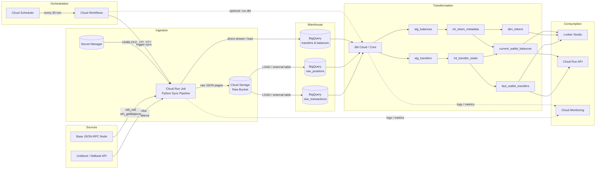

# Agent Accounting Data Pipeline — GCP Edition

End-to-end flow using the Google Cloud suite: **Uniblock / DeBank API + On-Chain JSON-RPC → GCS (raw) → BigQuery (warehouse) → dbt (transformed models) → Looker Studio / API**, orchestrated by **Cloud Scheduler + Cloud Workflows** (no Cloud Composer).

## High-level Diagram


```mermaid
flowchart LR
    subgraph Sources
        U[Uniblock / DeBank API]
        RPC[Base JSON-RPC Node]
    end

    subgraph Ingestion
        CF[Cloud Run Job<br/>Python Sync Pipeline]
        SM[(Secret Manager)]
        GCS[(Cloud Storage<br/>Raw Bucket)]
    end

    subgraph Warehouse
        BQ1[(BigQuery<br/>raw_transactions)]
        BQ2[(BigQuery<br/>raw_positions)]
        BQ3[(BigQuery<br/>transfers & balances)]
    end

    subgraph Transformation
        DBT[dbt Cloud / Core]
        STG1[stg_transfers]
        STG2[stg_balances]
        INT1[int_transfer_totals]
        INT2[int_token_metadata]
        MART1[fact_wallet_transfers]
        MART2[dim_tokens]
        MART3[current_wallet_balances]
    end

    subgraph Consumption
        LS[Looker Studio]
        API[Cloud Run API]
        MON[Cloud Monitoring]
    end

    subgraph Orchestration
        CS[Cloud Scheduler]
        CW[Cloud Workflows]
    end

    U -->|GET /token/list<br>GET /total_balance| CF
    RPC -->|eth_call<br>eth_getBalance| CF
    SM -->|UNIBLOCK_API_KEY| CF
    CF -->|raw JSON pages| GCS
    CF -->|direct stream / load| BQ3
    GCS -->|LOAD / external table| BQ1
    GCS -->|LOAD / external table| BQ2
    BQ1 --> DBT
    BQ2 --> DBT
    BQ3 --> DBT
    DBT --> STG1
    DBT --> STG2
    STG1 --> INT1
    STG2 --> INT2
    INT1 --> MART1
    INT2 --> MART2
    INT1 & INT2 --> MART3
    MART1 & MART2 & MART3 --> LS
    MART1 & MART3 --> API
    CF -.->|logs / metrics| MON
    DBT -.->|logs / metrics| MON
    CS -->|every 30 min| CW
    CW -->|trigger sync| CF
    CW -.->|optional: run dbt| DBT
```

## GCP Service Mapping

| Concern | Open Source / Alternative | GCP Version |
|---------|---------------------------|-------------|
| Object storage | S3 / MinIO | **Cloud Storage (GCS)** |
| Data warehouse | PostgreSQL / Snowflake | **BigQuery** |
| Transformation | dbt Core | **dbt + BigQuery** |
| Orchestration | Airflow / Dagster | **Cloud Scheduler + Cloud Workflows** |
| Compute for sync script | EC2 / Celery worker | **Cloud Run Jobs** |
| Secrets | Vault / env files | **Secret Manager** |
| Monitoring | Datadog / Prometheus | **Cloud Monitoring** |
| Dashboards | Grafana / Metabase | **Looker Studio / HTML Audit Dashboards** |
| API serving | FastAPI container | **Cloud Run** |

## Stage-by-Stage Breakdown

### 1. Extract & Land Raw (Uniblock / DeBank API → GCS)

Run the Python sync pipeline as a **Cloud Run Job**. Cloud Run Jobs are built for finite batch work: they start, run, and terminate, minimizing infrastructure cost.

**GCS key layout:**

```text
gs://agent-accounting-raw-data/
  wallet_address=0x42b9df65b219b3dd36ff330a4dd8f327a6ada990/
    entity=transactions/
      year=2026/month=08/day=29/
        page_001_20260829_190255.json
    entity=positions/
      year=2026/month=08/day=29/
        page_001_20260829_190255.json
```

**Secrets:**

Store `UNIBLOCK_API_KEY` in **Secret Manager** and mount it into the Cloud Run Job:

```bash
gcloud secrets create uniblock-api-key --data-file=.env
```

### 2. BigQuery Loading & Ingestion

BigQuery hosts both raw JSON landings and structured analytical tables.

**Raw Table Schema:**

```sql
CREATE TABLE IF NOT EXISTS `agent_accounting.raw_transactions` (
  wallet_address STRING NOT NULL,
  agent_name STRING,
  run_timestamp TIMESTAMP NOT NULL,
  page_index INT64 NOT NULL,
  payload JSON NOT NULL,
  loaded_at TIMESTAMP NOT NULL
)
PARTITION BY DATE(run_timestamp)
CLUSTER BY wallet_address;

CREATE TABLE IF NOT EXISTS `agent_accounting.raw_positions` (
  wallet_address STRING NOT NULL,
  agent_name STRING,
  run_timestamp TIMESTAMP NOT NULL,
  page_index INT64 NOT NULL,
  payload JSON NOT NULL,
  loaded_at TIMESTAMP NOT NULL
)
PARTITION BY DATE(run_timestamp)
CLUSTER BY wallet_address;
```

**Structured Warehouse Tables:**

Directly loaded by [`dag/bigquery_loader.py`](../dag/bigquery_loader.py):
- `agent_accounting.transfers`
- `agent_accounting.balances`
- `agent_accounting.balance_reconciliation`

### 3. Orchestration: Cloud Scheduler + Cloud Workflows

Cloud Workflows orchestrates the entire cycle without running a persistent Airflow cluster.

**`workflows/agent_accounting_pipeline.yaml`:**

```yaml
main:
  steps:
    - init:
        assign:
          - project_id: ${sys.get_env("GOOGLE_CLOUD_PROJECT_ID")}
          - region: "us-central1"
          - job_name: "agent-accounting-sync"
    - run_sync_job:
        call: googleapis.run.v2.namespaces.jobs.run
        args:
          name: ${"namespaces/" + project_id + "/jobs/" + job_name}
        result: execution
    - wait_for_job:
        call: googleapis.run.v2.namespaces.executions.get
        args:
          name: ${execution.body.metadata.name}
        result: job_status
    - check_status:
        switch:
          - condition: ${job_status.body.status.completionTime != null}
            next: sync_completed
        next: sleep_and_poll
    - sleep_and_poll:
        call: sys.sleep
        args:
          seconds: 10
        next: wait_for_job
    - sync_completed:
        return: ${job_status.body.status}
```

Triggered every 30 minutes via Cloud Scheduler:

```bash
gcloud scheduler jobs create http agent-accounting-30min \
  --schedule="*/30 * * * *" \
  --uri="https://workflowexecutions.googleapis.com/v1/projects/your-gcp-project/locations/us-central1/workflows/agent-accounting-pipeline/executions" \
  --oauth-service-account-email=accounting-scheduler@your-gcp-project.iam.gserviceaccount.com
```

### 4. Terraform IaC Deployment

Complete infrastructure is managed with Terraform:

```bash
cd terraform/minimal
terraform init
terraform apply
```

Resources managed:
| Terraform Resource | Description |
|--------------------|-------------|
| `google_storage_bucket.raw_data` | Raw JSON landing zone |
| `google_bigquery_dataset.agent_accounting` | Dataset for warehouse & raw tables |
| `google_bigquery_table.transfers` | Partitioned & clustered ERC-20 transfers |
| `google_bigquery_table.balances` | Partitioned token balances |
| `google_bigquery_table.balance_reconciliation` | Multi-agent balance audit records |
| `google_secret_manager_secret.uniblock_api_key` | Stores `UNIBLOCK_API_KEY` |
| `google_service_account.accounting_sync` | Runtime identity for Cloud Run Job |
| `google_cloud_run_v2_job.accounting_sync` | Cloud Run batch sync container |
