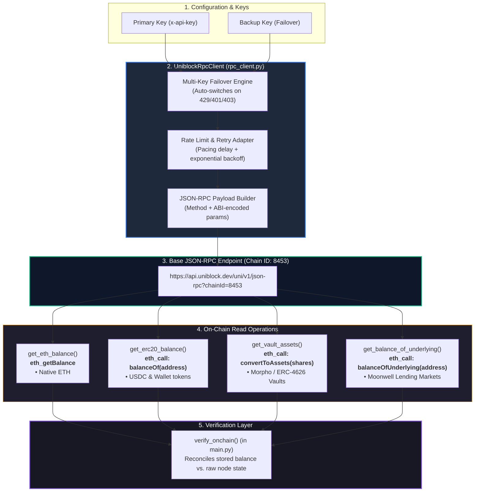

# RPC Client Architecture & Flow (`rpc_client.py`)

**File:** [`rpc_client.py`](file:///c:/Users/chris/Projects/agent-accounting/rpc_client.py)  
**Endpoint:** `https://api.uniblock.dev/uni/v1/json-rpc?chainId=8453` (Base Mainnet)  
**Role:** Independent on-chain ground-truth layer for balance verification.  

---

## 1. Architectural Diagram

---

## 2. Why Independent RPC Verification?

Indexers and portfolio aggregators (such as Zerion and DeBank) occasionally suffer from:
1. **Pricing delays / anomalies** (e.g., mispricing wrapped receipt tokens like `edgeUSDC`).
2. **Missing recent protocol deposits** (indexing lag after block rebalancing).
3. **Ghost / cached balances**.

By reading directly from Base JSON-RPC nodes via `UniblockRpcClient`, the accounting system retrieves **immutable, un-indexed contract storage values** directly from the blockchain to serve as the ground truth.

---

## 3. Function Selectors & Call Specifications

| Function Name | Hex Selector | ABI Signature | Usage |
| :--- | :--- | :--- | :--- |
| **`balanceOf`** | `0x70a08231` | `balanceOf(address)` | Reads raw token balances (USDC, WETH, AERO). |
| **`convertToAssets`** | `0x07a2d13a` | `convertToAssets(uint256)` | Converts ERC-4626 vault shares into redeemable underlying USDC (Morpho, Steakhouse, Clearstar, Euler). |
| **`getAllMarkets`** | `0xb0772d0b` | `getAllMarkets()` | Queries Moonwell Comptroller to resolve all active lending pools. |
| **`underlying`** | `0x6f307dc3` | `underlying()` | Queries `mToken` contract to discover its underlying asset address. |
| **`balanceOfUnderlying`**| `0x3af9e669` | `balanceOfUnderlying(address)`| Queries user's total accrued underlying assets supplied in Moonwell money markets. |

---

## 4. Key Client Features

### 4.1. Automated Dual-Key Failover
- Accepts both `api_key` and optional `backup_api_key` (or comma-separated key lists).
- If an HTTP `429` (Rate Limited), `401` (Unauthorized), or `403` (Forbidden) error occurs, the client automatically rotates headers to the backup key without raising an exception or stalling the pipeline.
- All subsequent calls in that execution session stay on the active working key.

### 4.2. Connection Pooling & Retry Adapter
- Mounts custom `urllib3.util.retry.Retry` strategy for handling intermittent `500`, `502`, `503`, and `504` node gateway timeouts.
- Configurable `rate_limit_delay` (default `0.15s`) prevents burst rate-limiting across consecutive queries.

### 4.3. Comptroller & Market Caching
- When verifying Compound/Moonwell money markets, `get_markets(comptroller)` caches market-to-underlying pairs in `self._market_cache` to minimize duplicate RPC requests across agents.
