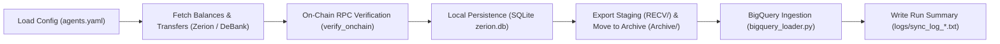

# Project Scripts Documentation & Reference Guide

**Project:** Agent Accounting & Multi-Wallet Tracking Pipeline  
**Repository:** `agent-accounting`  
**GCP Project:** `agent-accounting-506719`  

This document serves as the comprehensive technical reference for all Python and PowerShell scripts across the codebase, detailing their roles, CLI parameters, environment variables, and usage examples.

---

## 1. Quick Reference Index

| Script | Type | Role | Typical Command |
| :--- | :--- | :--- | :--- |
| [`main.py`](file:///c:/Users/chris/Projects/agent-accounting/main.py) | Python | Core pipeline: ingest, reconcile, verify on-chain, export & archive | `python main.py` |
| [`rpc_client.py`](file:///c:/Users/chris/Projects/agent-accounting/rpc_client.py) | Python | Base JSON-RPC client with automated key failover | *Imported by `main.py`* |
| [`zerion_client.py`](file:///c:/Users/chris/Projects/agent-accounting/zerion_client.py) | Python | Zerion API v1 client (transfers, positions, wallets) | *Imported by `main.py`* |
| [`uniblock_client.py`](file:///c:/Users/chris/Projects/agent-accounting/uniblock_client.py) | Python | Uniblock DeBank REST proxy client with failover | *Imported by `main.py`* |
| [`storage.py`](file:///c:/Users/chris/Projects/agent-accounting/storage.py) | Python | SQLite persistence layer (`zerion.db`) | *Imported by `main.py`* |
| [`bigquery_loader.py`](file:///c:/Users/chris/Projects/agent-accounting/bigquery_loader.py) | Python | BigQuery exporter (`balances`, `transfers`, `reconciliation`) | *Imported by `main.py`* |
| [`demo_fetch.py`](file:///c:/Users/chris/Projects/agent-accounting/demo_fetch.py) | Python | CLI testing tool to probe Zerion and DeBank for any agent | `python demo_fetch.py --wallet 0x...` |
| [`demo_rpc_reader.py`](file:///c:/Users/chris/Projects/agent-accounting/demo_rpc_reader.py) | Python | CLI testing tool to read raw on-chain state via JSON-RPC | `python demo_rpc_reader.py --wallet 0x...` |
| [`build_usdc_balance_data.py`](file:///c:/Users/chris/Projects/agent-accounting/build_usdc_balance_data.py) | Python | Aggregates archive snapshots for the interactive HTML chart | `python build_usdc_balance_data.py` |
| [`test_sync.py`](file:///c:/Users/chris/Projects/agent-accounting/test_sync.py) | Python | Pytest unit test suite (12 tests) | `pytest test_sync.py` |
| [`test_archive_flow.py`](file:///c:/Users/chris/Projects/agent-accounting/test_archive_flow.py) | Python | Smoke test for staging, moving to archive, and logging | `python test_archive_flow.py` |
| [`trigger_sync.ps1`](file:///c:/Users/chris/Projects/agent-accounting/trigger_sync.ps1) | PowerShell | Trigger Cloud Run job, update secrets, deploy, stream logs | `.\trigger_sync.ps1 -UpdateSecret` |
| [`deploy-cloudbuild.ps1`](file:///c:/Users/chris/Projects/agent-accounting/deploy-cloudbuild.ps1) | PowerShell | Remote container build and deploy via Google Cloud Build | `.\deploy-cloudbuild.ps1` |
| [`download_logs.ps1`](file:///c:/Users/chris/Projects/agent-accounting/download_logs.ps1) | PowerShell | Resumable download of sync run logs from GCS | `.\download_logs.ps1` |
| [`download_archive.ps1`](file:///c:/Users/chris/Projects/agent-accounting/download_archive.ps1) | PowerShell | Download raw JSON archives from GCS | `.\download_archive.ps1` |
| [`download_full_archive.ps1`](file:///c:/Users/chris/Projects/agent-accounting/download_full_archive.ps1) | PowerShell | Complete historical GCS archive synchronization | `.\download_full_archive.ps1` |
| [`export_tables.ps1`](file:///c:/Users/chris/Projects/agent-accounting/export_tables.ps1) | PowerShell | Exports BigQuery tables to local CSVs in `bq_exports/` | `.\export_tables.ps1` |
| [`deploy.ps1`](file:///c:/Users/chris/Projects/agent-accounting/deploy.ps1) | PowerShell | Local Docker build and Terraform deployment script | `.\deploy.ps1` |

---

## 2. Core Python Pipeline Scripts

### 2.1. `main.py` — Orchestrator & Execution Engine
[`main.py`](file:///c:/Users/chris/Projects/agent-accounting/main.py) is the primary entry point executed in Cloud Run containers and locally.

#### Core Workflow:


#### CLI Parameters:
- `--wallet`: Track a single wallet address (bypasses `agents.yaml`).
- `--agents-config`: Path to agent configuration file (default: `agents.yaml`, env: `AGENTS_CONFIG`).
- `--chain-ids`: Comma-separated chains to sync (default: `base`, env: `CHAIN_IDS`).
- `--output-dir`: Temporary staging directory for JSON files before archiving (default: `./RECV`).
- `--archive-dir`: Final destination for immutable JSON archives (default: `./Archive`).
- `--logs-dir`: Directory for per-run summary text logs (default: `./logs`).
- `--bq-dataset`: BigQuery target dataset (default: `agent_accounting`, env: `BQ_DATASET`).
- `--bq-project`: BigQuery Google Cloud project ID (default: inferred from GCP credentials).
- `--skip-bq`: Flag to skip loading into BigQuery.
- `--skip-uniblock`: Disables DeBank fallback for wallets unsupported by Zerion.
- `--skip-rpc`: Disables on-chain JSON-RPC ground-truth verification.
- `--db-path`: Path to SQLite database file (default: `zerion.db`).

#### Environment Variables Used:
- `ZERION_API_KEY`: API key for Zerion REST API.
- `UNIBLOCK_API_KEY`: Primary API key for DeBank REST proxy and Base JSON-RPC.
- `UNIBLOCK_API_KEY_BACKUP`: Secondary backup API key for automated failover.
- `WALLET_ADDRESS`: Fallback wallet if `agents.yaml` is absent.

---

### 2.2. `rpc_client.py` — Base JSON-RPC Client
[`rpc_client.py`](file:///c:/Users/chris/Projects/agent-accounting/rpc_client.py) connects directly to Base mainnet nodes (`chainId=8453`) through Uniblock's JSON-RPC endpoint.

#### Key Functions & Methods:
- `UniblockRpcClient(api_key, backup_api_key, rate_limit_delay)`: Initializes the client with multi-key rotation and pacing.
- `get_block_number() -> int`: Reads current Base block height via `eth_blockNumber`.
- `get_eth_balance(wallet) -> int`: Reads native ETH balance in wei via `eth_getBalance`.
- `get_erc20_balance(token, wallet) -> int`: Reads ERC-20 balance via `eth_call balanceOf(address)`.
- `get_vault_assets(vault, wallet) -> (shares, assets)`: Reads ERC-4626 vault shares and calls `convertToAssets(shares)` to obtain underlying assets (Morpho, Steakhouse, Clearstar, Euler).
- `get_balance_of_underlying(market, wallet) -> int`: Reads user's accrued underlying assets in Moonwell lending markets via `balanceOfUnderlying(address)`.
- `find_market_for_underlying(comptroller, token) -> str`: Resolves Comptroller market for a specific token address.

---

### 2.3. `zerion_client.py` — Zerion API Client
[`zerion_client.py`](file:///c:/Users/chris/Projects/agent-accounting/zerion_client.py) interfaces with Zerion's v1 REST API (`https://api.zerion.io/v1`).

#### Key Methods:
- `get_wallet_portfolio(wallet)`: Retrieves total portfolio value and chain-level breakdown.
- `get_positions(wallet)`: Generator yielding parsed DeFi positions, staked assets, and wallet tokens.
- `get_transactions(wallet)`: Generator yielding transaction history and multi-asset transfers.
- `get_raw_positions(wallet)` & `get_raw_transactions(wallet)`: Returns raw unparsed API page payloads for raw archiving.

---

### 2.4. `uniblock_client.py` — DeBank Proxy REST Client
[`uniblock_client.py`](file:///c:/Users/chris/Projects/agent-accounting/uniblock_client.py) communicates with DeBank Open API via Uniblock's direct proxy (`https://api.uniblock.dev/direct/v1/DeBank`).

#### Key Methods:
- `get_total_balance(wallet)`: High-level USD portfolio balance.
- `get_all_token_list(wallet, is_all)`: Token holdings across all supported chains.
- `get_complex_protocol_list(wallet, chain_ids)`: Deep breakdown of DeFi yield positions, supplied liquidity, and rewards.
- `get_all_history_list(wallet, chain_ids, page_count)`: Cross-chain transaction history.
- `_switch_to_next_key(reason)`: Auto-failover handler for HTTP 429/401/403.

---

### 2.5. `storage.py` — Local Database Layer
[`storage.py`](file:///c:/Users/chris/Projects/agent-accounting/storage.py) manages the local SQLite database (`zerion.db`) used for staging, deduplication, and local caching.

#### Tables Managed:
1. `balances`: Stores per-token / per-position snapshots (`agent_name`, `wallet`, `token_symbol`, `balance_float`, `usd_value`, `timestamp`).
2. `transfers`: Stores transaction transfer events (`tx_hash`, `direction`, `symbol`, `amount`, `usd_value`).

---

### 2.6. `bigquery_loader.py` — BigQuery Streaming & Loading
[`bigquery_loader.py`](file:///c:/Users/chris/Projects/agent-accounting/bigquery_loader.py) handles automated ingestion into Google BigQuery dataset `agent_accounting`.

#### Tables Ingested:
- `balances`: Detailed per-token position records.
- `transfers`: Normalized transfer ledger.
- `balance_reconciliation`: High-level sync audit log storing `stored_total_usd`, `onchain_total_usd`, `delta_pct`, and verdict (`OK` or `MISMATCH`).

---

## 3. Standalone CLI & Testing Tools

### 3.1. `demo_fetch.py` — Live API Probe Tool
[`demo_fetch.py`](file:///c:/Users/chris/Projects/agent-accounting/demo_fetch.py) is a standalone diagnostic tool to inspect API responses for agents without writing to SQLite or BigQuery.

#### Usage:
```bash
# Check all agents in agents.yaml
python demo_fetch.py

# Check a single specific wallet
python demo_fetch.py --wallet 0x6a9e4e59df3e65fdb6a2f8d1ab6f0cd3943c015b

# Check raw JSON outputs
python demo_fetch.py --wallet 0x6a9e... --raw
```

---

### 3.2. `demo_rpc_reader.py` — Direct JSON-RPC State Reader
[`demo_rpc_reader.py`](file:///c:/Users/chris/Projects/agent-accounting/demo_rpc_reader.py) queries Base smart contracts directly via JSON-RPC to inspect native ETH, USDC, Morpho vaults, and Moonwell markets.

#### Usage:
```bash
# Query default wallet
python demo_rpc_reader.py

# Query a custom wallet
python demo_rpc_reader.py --wallet 0x3de51ddb55ffec013f428288559dd993e9eeb6b6
```

---

### 3.3. `build_usdc_balance_data.py` — Dashboard Data Aggregator
[`build_usdc_balance_data.py`](file:///c:/Users/chris/Projects/agent-accounting/build_usdc_balance_data.py) parses all timestamped balance JSONs in `archive_downloads/full_archive`, aggregates daily USDC totals per agent, and compiles:
1. `usdc_balance_data.json`
2. Patches the embedded data fallback inside `usdc_balance_chart.html` for local browser viewing.

#### Usage:
```bash
python build_usdc_balance_data.py
```

---

### 3.4. `test_sync.py` — Pytest Automated Unit Suite
[`test_sync.py`](file:///c:/Users/chris/Projects/agent-accounting/test_sync.py) provides 12 automated unit tests covering:
- Primary and backup API key parsing.
- Automated failover on HTTP 429 in REST and RPC clients.
- File export formatting, raw position packaging, and timestamping.
- Balance reconciliation delta calculations.
- Agent error handling and pipeline isolation.

#### Usage:
```bash
pytest test_sync.py -v
```

---

## 4. PowerShell Automation & GCP Scripts

### 4.1. `trigger_sync.ps1` — GCP Cloud Run Orchestration
[`trigger_sync.ps1`](file:///c:/Users/chris/Projects/agent-accounting/trigger_sync.ps1) triggers the `zerion-sync` Cloud Run job on GCP.

#### Parameters:
- `-UpdateSecret`: Pushes the latest `UNIBLOCK_API_KEY_BACKUP` from `.env` to GCP Secret Manager `uniblock-api-key` before running.
- `-DeployCode`: Triggers Cloud Build to rebuild the Docker image with latest code/config before executing.
- `-NoWait`: Submits the job asynchronously and returns immediately.
- `-ShowLogs`: Displays the latest Cloud Run execution logs after execution finishes.

#### Usage:
```powershell
# Standard execution and wait
.\trigger_sync.ps1

# Update GCP secret with new key and trigger
.\trigger_sync.ps1 -UpdateSecret

# Rebuild container, update secret, and run job
.\trigger_sync.ps1 -UpdateSecret -DeployCode
```

---

### 4.2. `deploy-cloudbuild.ps1` — Remote Container Deployment
[`deploy-cloudbuild.ps1`](file:///c:/Users/chris/Projects/agent-accounting/deploy-cloudbuild.ps1) builds the container image directly in Google Cloud Build and pushes it to Google Artifact Registry (`us-central1-docker.pkg.dev/agent-accounting-506719/zerion/zerion-sync:latest`). Local Docker is **not required**.

#### Usage:
```powershell
.\deploy-cloudbuild.ps1
```

---

### 4.3. `download_logs.ps1` — Sync Run Logs Downloader
[`download_logs.ps1`](file:///c:/Users/chris/Projects/agent-accounting/download_logs.ps1) pulls sync execution text logs from `gs://agent-accounting-506719-zerion-raw-data/logs/` into `.\logs_downloads\`.

#### Usage:
```powershell
.\download_logs.ps1
```

---

### 4.4. `download_full_archive.ps1` — Complete Archive Synchronization
[`download_full_archive.ps1`](file:///c:/Users/chris/Projects/agent-accounting/download_full_archive.ps1) uses `gcloud storage rsync` to download all historical JSON balance, transfer, and protocol files from GCS into `.\archive_downloads\full_archive\`.

#### Usage:
```powershell
.\download_full_archive.ps1
```

---

### 4.5. `export_tables.ps1` — BigQuery Table Exporter
[`export_tables.ps1`](file:///c:/Users/chris/Projects/agent-accounting/export_tables.ps1) queries BigQuery tables (`balances`, `transfers`, `balance_reconciliation`) and dumps full exports to CSV in `.\bq_exports\`.

#### Usage:
```powershell
.\export_tables.ps1
```
