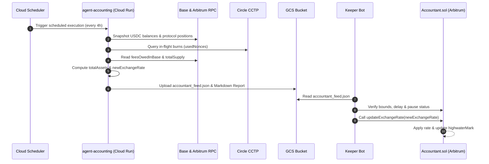

# Bond Vault Accountant Architecture & Valuation Guide

This document details the architecture, pricing engine, safety mechanisms, and valuation workflow of the **Bond Credit Vault** (`BoringVault` + `AccountantWithRateProviders`). It explains how the multi-chain vault system operates and how the off-chain accounting pipeline safely provides the canonical exchange rate.

---

## 1. Multi-Chain System Overview

The Bond Credit protocol utilizes a multi-chain architecture to accept capital on a liquid home chain while deploying it into automated DeFi venue strategies on a high-throughput execution chain:

* **Home Chain — Arbitrum (`Chain ID: 42161`):**
  * **`BoringVault` (`0xFf0d384bE00f3Fc36FA03C0A38b08C235a28EEBc`):** Holds underlying USDC, mints and burns ERC-20 vault share tokens.
  * **`Teller` (`0x2b1df512B24347Caf48508c2695c9d0b190722c4`):** User deposit gateway. Converts deposits to shares using the rate from the Accountant. Enforces optional share lock periods (up to 3 days) and share premiums.
  * **`Accountant` (`0xFCD1EaC46f1eE0058BA8ceAe0B4139F609c2c541`):** The canonical pricing contract (`AccountantWithRateProviders`). Stores the share exchange rate, high-water mark, fee accruals, and pause state.
  * **`DelayedWithdraw` (`0x3Ae10bC67AB3E14043364587B27Aec68c7da4638`):** 30-day redemption escrow with symmetric `maxLoss` slippage tolerance.
  * **`BoringOnChainQueue` (`0xd6285820F65913fE42760356f71F9d2405890C7d`):** 1-day solve queue enabling market solvers to fulfill withdrawals at a user-defined discount.
  * **`ManagerWithMerkleVerification` & `AgentStrategyDecoderAndSanitizer`:** Security layer ensuring strategists can only execute pre-approved, Merkle-whitelisted calls.
  * **`BridgeAgentStrategy` (`0xEC9479F1125A5CC7a3ab16FfB09834F7B2c92b36`):** Fixed vault destination that bridges USDC to Base via Circle CCTP (`TokenMessenger.depositForBurn`).

* **Venue Chain — Base (`Chain ID: 8453`):**
  * **`ManagedGenericAgentStrategy`:** Venue agent contracts governed directly by Bond Credit Safe multisigs and authenticated via ERC-1271 signing keys:
    * **Mamo Strategy (`0x54F904ae06B6469d118c4C0010F29626e19D3Ce5`):** Deploys capital into Moonwell money markets and MetaMorpho vaults (`ERC20MoonwellMorphoStrategy`).
    * **Zyfai Strategy (`0xF8aB601573612323B96d568248FD518E3821FE17`):** Deploys capital into automated Zyfai yield strategies.
    * **Yieldseeker Strategy (`0xc663aE634045917481Ab5977534c341Aa1f9DdB8`):** Deploys capital into Euler and MetaMorpho vaults via smart agent wallets.

---

## 2. Role of `Accountant.sol` & The Pushed NAV Model

Because the vault's assets are distributed across multiple chains, smart contracts, and external lending/yield protocols, **no single on-chain contract can natively calculate total cross-chain NAV**.

Therefore, the `Accountant` uses a **pushed valuation model**:
1. An off-chain service (`agent-accounting`) indexes all balances, protocol positions, and in-flight transfers.
2. The service calculates the net exchange rate.
3. An authorized keeper submits `accountant.updateExchangeRate(newExchangeRate)` to Arbitrum.
4. All subsequent deposits (via `Teller`) and redemptions (via `DelayedWithdraw` or `BoringOnChainQueue`) trade at this rate until the next update.

> [!CAUTION]
> The pushed exchange rate is the single source of truth for vault solvency.
> * If the rate is pushed **too high**, redeeming users extract more than their share of assets, leaving remaining depositors with a deficit.
> * If the rate is pushed **too low**, incoming depositors mint shares at a discount, diluting existing holders.

---

## 3. Circuit Breakers & The Auto-Pause Mechanism

To guard against bad off-chain data, oracle exploits, or extreme flash crashes, `AccountantWithRateProviders.sol` implements an **auto-pause safety pattern**:

### Auto-Pause Instead of Reverting
When `updateExchangeRate(uint96 newExchangeRate)` is called:
```solidity
shouldPause = currentTime < state.lastUpdateTimestamp + state.minimumUpdateDelayInSeconds
    || newExchangeRate > currentExchangeRate.mulDivDown(state.allowedExchangeRateChangeUpper, 1e4)
    || newExchangeRate < currentExchangeRate.mulDivDown(state.allowedExchangeRateChangeLower, 1e4);
```
If `shouldPause == true`, **the contract does not revert**. Instead:
1. It writes the `newExchangeRate`.
2. It sets `isPaused = true`.
3. It emits `Paused()`.

### Why Pausing is Safer Than Reverting
If an invalid update simply reverted:
* The transaction would fail, and the contract would **silently continue operating on the old rate**.
* If a real 10% market crash occurred, users could rush to redeem at the stale, inflated rate before anyone intervened.
* By writing the rate and setting `isPaused = true`, all deposits, withdrawals, and fee claims (`getRateSafe`) immediately revert. The entire system halts safely until an operator inspects the valuation and unpauses.

---

## 4. High-Water Mark & Fee Accruals

The `Accountant` manages two types of protocol fees:
1. **Platform Fee:** Continuous annual fee accrued on total assets over elapsed time (`timeDelta / 365 days`).
2. **Performance Fee:** Accrued strictly on yield generated **above the `highwaterMark`**.

### High-Water Mark Protection
* `highwaterMark` records the highest exchange rate the vault has ever achieved.
* If a vault drops from `1.10` to `1.00` and later climbs back to `1.10`, **no performance fee is charged** on the recovery climb.
* Once the rate surpasses `1.10`, performance fees resume only on the gain above `1.10`, after which the mark moves up to the new peak.

### Unclaimed Fees as Liabilities (`feesOwedInBase`)
* Fees are accrued into `feesOwedInBase` (in underlying USDC units) during each rate update.
* Fees remain inside the vault until `claimFees` is called by the vault.
* **Critical Valuation Invariant:** Because accrued fees belong to `payoutAddress`, they are an outstanding liability. During rate calculation, **`feesOwedInBase` must be subtracted from total assets**, otherwise vault shares are overvalued.

---

## 5. Inflation & Donation Attack Defenses

In standard ERC-4626 and vault contracts, an attacker can deposit 1 wei, donate a large sum directly to the vault, and inflate the share price to steal funds from the next depositor.

In `bond-app`:
1. Raw ERC-20 transfers into `BoringVault` do **not** mint shares and do **not** automatically update the exchange rate (the rate is pushed, not read from raw balance).
2. The danger occurs if the off-chain keeper naively updates the exchange rate using $\text{NAV} / \text{totalShares}$ while `totalShares` is only dust.
3. **Defense Rule:** While the vault is in the bootstrapping phase (e.g. before honest public deposits have entered), the keeper **must pin the exchange rate to `1e6` (1.00 USDC)** and not fold initial venue funding donations into NAV.

---

## 6. End-to-End Operational Pipeline


